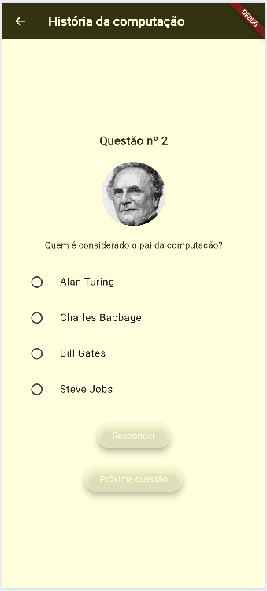
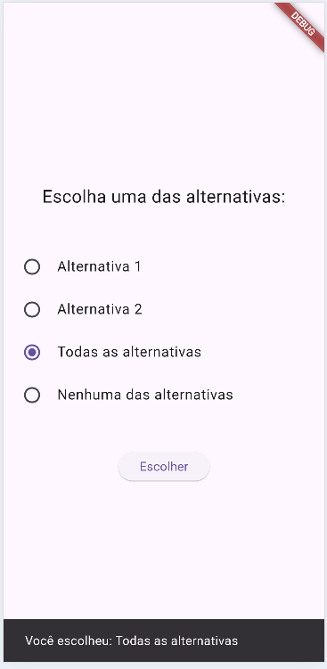

# Aula08

## Objetivos
- Splash Screen
    - Animações, movimento e escala
- Passar informações entre telas
    - Biblioteca: shared_preferences.dart / SharedPreferences
- Tema
    - Paleta de cores
    - Estilização de tema para o App
- Leitura de dados de aquivo local de texto JSON
    - rootBundle.loadString()
- Escolha de opções com "radio button"
    - RadioGroup()
- Builder
    - Criar o arquivo **.apk** para testar em celular Android

## Projetos de exemplo
- Primeiro desafio [SplashScreen](https://github.com/wellifabio/flutter-splash-shared-2026.git): Animação e passar dados entre telas
    - Teste este projeto
    - Estude os códigos do diretório **lib**
    - Apos testar com seu VsCode, feche o projeto e o VsCode
    - Faça a atividade proposta criando um novo app do Zero
- Segundo desafio [Estilização e Mockup](https://github.com/wellifabio/flutter-estilo-mokup-json-2026.git): Estilização e Carregar dados de arquivo de texto Mockup.
    - Teste este projeto
    - Estude os códigos do diretório **lib**
    - Apos testar com seu VsCode, feche o projeto e o VsCode
    - Faça a atividade proposta criando um novo app do Zero
- Desafio final desta aula
    - Desenvolva o mesmo **quiz** que foi feito nas aulas de Mit App Inventor agora em flutter
<br>
    - Transcreva as perguntas para um arquivo json no modelo abaixo e salve na pasta assets/mokup/ de seu projeto
    - Abra as perguintas ná pagina principal do seu App e renderize as alternativas
```json
[
    {
        "id": 1,
        "ilustracao":"https://admin.cnnbrasil.com.br/wp-content/uploads/sites/12/2021/06/26776_1798DEE935286D54.jpg?w=1024",
        "pergunta": "Qual o primeiro computador digital construído?",
        "respostas": [
            "Robotinic",
            "ENIAC",
            "ABACO",
            "Máquina de calcular de Leibniz"
        ],
        "correta": 2
    },
    {
        "id": 2,
        "ilustracao":"https://encrypted-tbn0.gstatic.com/images?q=tbn:ANd9GcRbppAC3zloJbY5EaWYgEllsV-gaoSzMlzzNw&s",
        "pergunta": "Quem é considerado o pai da computação?",
        "respostas": [
            "Alan Turing",
            "Charles Babbage",
            "Bill Gates",
            "Steve Jobs"
        ],
        "correta": 2
    },
    {
        "id": 3,
        "pergunta": "Qual foi a primeira linguagem de programação de alto nível?",
        "respostas": [
            "Assembly",
            "COBOL",
            "Fortran",
            "C"
        ],
        "correta": 3
    }
]
```
- Ao concluir **gere o arquivo de instalação .apk** envie o arquivo para o github e instale no seu celular android ou um da escola para testar.

## Tutoriais
#### Iniciar um novo projeto flutter
- Abra o vscode, pressione CTRL + Shift + P e digite **flutter**, clique em **New Project**, escolha **"Empty..."** projeto vazio.
- Selecione a pasta "Área de trabalho" por exemplo
- Coloque o nome do projeto, todas em minúsculas sem espaços ex: "flutter_splash_aula08"
- Pronto, um Alô Mundo será criado. basta executar em um navegador como o **Chrome** ou no Emulador do Android Estudio.
    - Encontre o arquivo lib/main e clique em play.
    - Configure o pubspec.yaml com as dependências necessárias
    - No terminal dê o comando flutter pub get para atualizar e execute o projeto novamente
    ```bash
    flutter pub get
    flutter run
    ```
## RadioGroup
Exemplo funcional de rario butons, com a lista ["Alternativa 1", "Alternativa 2", "Todas as alternativas", "Nenhuma das alternativas"]:
<table>
<tr>
<td>



</td>
<td>

```dart
import 'package:flutter/material.dart';

void main() {
  runApp(MaterialApp(title: "Opçãoes", home: Home()));
}

class Home extends StatefulWidget {
  final String? nome;
  const Home({super.key, this.nome});

  @override
  State<Home> createState() => _HomeState();
}

class _HomeState extends State<Home> {
  // 1. Define a lista de opções
  final List<String> opcoes = [
    "Alternativa 1",
    "Alternativa 2",
    "Todas as alternativas",
    "Nenhuma das alternativas",
  ];

  // 2. Variável para armazenar a seleção atual (inicia nula)
  String? opcao;

  void mostrarOpcao() {
    if (opcao != null) {
      ScaffoldMessenger.of(
        context,
      ).showSnackBar(SnackBar(content: Text("Você escolheu: $opcao")));
    } else {
      ScaffoldMessenger.of(
        context,
      ).showSnackBar(SnackBar(content: Text("Nenhuma opção selecionada.")));
    }
  }

  @override
  Widget build(BuildContext context) {
    return Scaffold(
      body: Center(
        child: Column(
          mainAxisAlignment: MainAxisAlignment.center,
          spacing: 40,
          children: [
            Text(
              "Escolha uma das alternativas:",
              style: TextStyle(fontSize: 20),
              textAlign: TextAlign.center,
            ),
            RadioGroup<String>(
              onChanged: (value) => setState(() {
                opcao = value!;
              }),
              groupValue: opcao,
              child: Column(
                children: [
                  ...List.generate(
                    opcoes.length,
                    (i) =>
                        RadioListTile(title: Text(opcoes[i]), value: opcoes[i]),
                  ),
                ],
              ),
            ),
            ElevatedButton(onPressed: mostrarOpcao, child: Text("Escolher")),
          ],
        ),
      ),
    );
  }
}
```

</td>
</tr>
</table>

## "Buildar" Gerar arquivo .APK
Ao concluir uma parte significativa do seu app, você pode gerar um arquivo de instalação para testes em celular android. para isso:
 - Acrescente a linha de comando a seguir
    ```xml
    <uses-permission android:name="android.permission.INTERNET"/>
    ```
    no arquivo ./android/app/src/main/AndroidManifest.xml para que as permissões de internet sejam habilitadas e caso utilize Imagens externas e API o flutter possa renderizar.
 - No terminal digite o seguinte comando
    ```bash
    flutter build apk --release
    ```
 - O arquivo APK será gerado e o comando irá mostrar o caminho, copie ele e cole na raiz do seu projeto
 - Envie para o github para que possa baixar e instalar em um celular Android.