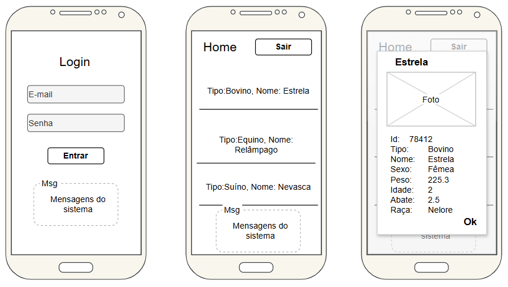

# [Aula09 - Consumo de API](https://meet.google.com/nhx-wcmc-tqs)
## Assuntos estudados
- Consumir API REST
- Estudar documentação de API com Swagger
- Utilizar Autenticação JWT
## Tema da API
- No repositório do link a seguir temos a API de um sistema de gestão rural [AgroTech](https://github.com/wellifabio/agro-api-jserver-swagger.git).
## Passos para estudo
- 1 Acesse este [repositório](https://github.com/wellifabio/agro-api-jserver-swagger.git),
- 2 Clone-o em seu computador
- 3 Siga as instruções em **Readme.md** para executar e testar com **Swagger**.

## Vamos testar a API
- Criando usuário
- Fazendo login
- Recebendo o token
- Armazenando em 'Authorize'
- Listando os usuários
- Cadastando um animal
- Listando os animais cadastrados
- Fazendo upload de imagem
## Prit da tela do Swagger


## Wrefame da UI(User Interface)

## Vamos desenvolver uma UI Web
- Para compreender o processo de segurança com autenticação JWT
- Página de login
- Página home, potegida pelas credenciais
- Listar Animais enviando o *Bearear token*
## Agora desenvolver uma UI Flutter
- Com base nos wireframes.

## Adicionar fontes ao aplicativo
Baixe no google fonts ou deste repositório o arquivo de fonte [PatrickHands](./PatrickHand-Regular.ttf) e salve em /assets/fonts em seu aplicativo
- Baixe o ícone do aplicativo também e salve em /assets/icone.png
- Altere o arquivo pubspec.yaml para habilitar baixar as dependências
  - ícone - flutter_launcher_icons:
  - fonte - fonts:
  - http: metodos CRUD RESC (get, post, put/patch e delete)
  - shared_preferences: salvar dados localmente entre as telas
  - intl: conversão de dados JSON

```dart
dependencies:
  flutter:
    sdk: flutter
  http: ^1.6.0
  shared_preferences: ^2.5.5
  intl: ^0.20.2

dev_dependencies:
  flutter_test:
    sdk: flutter
  flutter_lints: ^6.0.0
  flutter_launcher_icons: ^0.14.4

flutter_launcher_icons:
  android: true
  ios: true
  image_path: "assets/icone.png"

flutter:
  uses-material-design: true
  assets:
    - assets/
  fonts:
    - family: PatrickHand
      fonts:
      - asset: assets/fonts/PatrickHand-Regular.ttf
```
- De os comando a seguir para atualizar as dependências e o ícone do aplicativo:
- [Projeto iniciado](https://github.com/wellifabio/flutter_agrotech_api_jwt_lista_detalhes_2026.git)

```bash
flutter pub get
dart run flutter_launcher_icons
```
