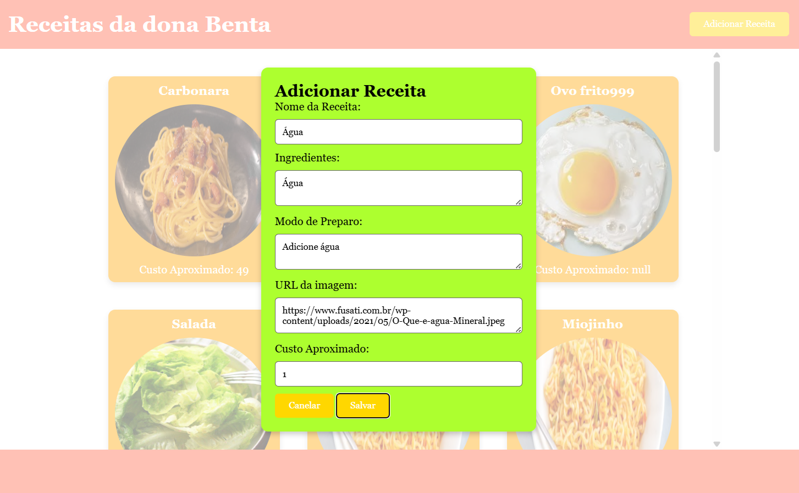

# Aula01 - Full Stack

## Consumindo API com fetch
Para esta aula vamos consumir a [API](https://receitasapi-b-2025.vercel.app/) que está no repositório https://github.com/wellifabio/receitasapi-b-2025.git e implantada na nuvem da **Vercel**

1 - Baixe o arquivo Insomnia_2026-03-27.yaml deste repositório e importe-o no sei Insomnia.
2 - Teste a API listando as receitas e enviando uma nova receita.

## Demonstração
Acoga vamos criar uma UI Frontend para manipular estas receitas.
 

## Atividade
Crie uma UI que liste as receitas em cards e um modal de cadastro semelhante ao da imagem acima