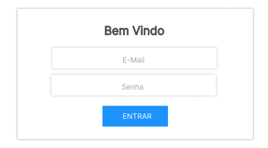
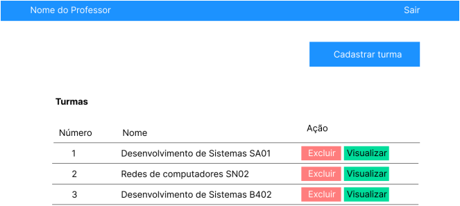
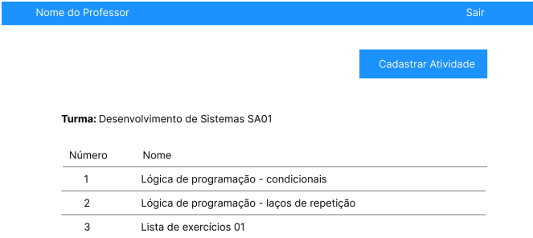

# Aula02 - Projeto Full Stack

### Situação de aprendizagem desafiadora
### Objetivo
O objetivo desta aula é desenvolver um sistema web full-stack para controle de **turmas** e **atividades** de **professores**, baseado no SAEP 2023.1.
## Contextualização
Na educação a falta de organização relacionada às atividades desenvolvidas pelos professores durante as aulas pode ocasionar problemas de gestão dos conhecimentos já trabalhados e avaliados. É fundamental, para que se possa atingir os objetivos educacionais, que os professores tenham controle sobre as atividades que serão aplicadas às turmas. Muitas escolas situadas em áreas remotas do Brasil não possuem um sistema para solucionar essa falta de organização, acarretando prejuízos aos estudantes, professores e ao processo educacional como um todo.

## Desafio
Você foi desafiado a desenvolver um sistema web ou desktop que permitirá ao professor se autenticar em um sistema para visualizar, registrar, excluir suas turmas, assim como registrar atividades para as suas turmas e sair do sistema.

## Resultados e entregas esperadas
|Nº|Requisitos|Tipo de requisito|Tempo estimado (minutos)|
|-|-|:-:|:-:|
|1|Back-end com a criação e conexão com o banco de dados|Funcional - Desenvolvimento do banco de dados e API|10|
|2|Tela de autenticação de usuários (login)|Funcional - Desenvolvimento do sistema|20|
|3|Tela principal do professor|Funcional - Desenvolvimento do sistema|15|
|4|Cadastro de turma|Funcional - Desenvolvimento do sistema|15|
|5|Listar turmas do professor|Desenvolvimento do sistema|20|
|6|Exclusão de turma|Funcional - Desenvolvimento do sistema|20|
|7|Tela de atividades da turma|Funcional - Desenvolvimento do sistema|15|
|8|Listar atividades da turma|Funcional - Desenvolvimento do sistema|15|
|9|Cadastro de atividade para a turma|Funcional - Desenvolvimento do sistema|15|
|10|Sair do sistema (logout)|Funcional - Desenvolvimento do sistema|05|
|11|Lista de requisitos de infraestrutura|Não Funcional - Documentação do sistema, README.md com descrição básica do sistema, lista das tecnologias, prints das telas e passo a passo de como executar o back-end e front-end localmente|05|

### Obss:
- Não é necessário controle de autenticação JWT.

### 1. Back-end com a criação e conexão com o banco de dados
Você deverá desenvolver o back-end com de criação e conexão com o banco de dados contendo a criação do banco de dados **“turmas_db”** e das tabelas de acordo com o diagrama entidade e relacionamento desenvolvido na entrega 2. Para teste deverão ser cadastrados pelo menos **três registros** para todas as tabelas criadas, respeitando os tipos de dados, chaves primárias e estrangeiras.
O script do banco de dados ou dados cadastrados deverão ser entregue no formato .sql ou exportação do **insomnia** .yaml e salvo na pasta **./docs**.

### 2. Tela de autenticação de usuários (login)
Você deverá desenvolver uma tela de autenticação de usuários contendo um campo para informar o e-mail, um campo para informar a senha e um botão “entrar”. Essa deverá ser a tela principal que o usuário verá ao acessar o sistema. O botão “entrar” deverá dar acesso a “tela principal do professor” caso o e-mail e senha informados sejam autenticados no banco de dados, criando então uma sessão. Caso o e-mail e senha não sejam autenticados, o usuário deverá ser redirecionado novamente à tela de autenticação. A imagem a seguir demonstra um exemplo do que deve ser desenvolvido nessa tela. O design do layout é de sua escolha, porém, deverá contemplar os elementos solicitados. (*Não é necessário autenticação JWT, somente redirecionamento*)
- 

### 3. Tela principal do professor
Você deverá desenvolver a tela principal do professor contendo os itens:
- Exibição do nome do professor autenticado no sistema
- Botão para sair do sistema
- Um botão para acesso ao “cadastro de turma”
- Listagem de turmas, contendo, os dados estáticos:
    - Número da turma
    - Nome da turma
    - Botão para excluir
    - Botão para visualizar
- A imagem (wireframe) a seguir representa um exemplo do que deve ser desenvolvido nessa tela. O design do layout é de sua escolha, porém, deverá contemplar os elementos solicitados.
- 

### 4. Cadastro de turma
Você deverá desenvolver uma tela contendo um campo, onde o usuário irá informar o nome da turma e um botão “cadastrar”. No banco de dados, deve ser registrada uma nova turma considerando o nome informado e o professor que cadastrou a turma. Uma turma pertence somente a um professor, porém, o
professor pode ter várias turmas.

### 5. Listar turmas do professor
Na tela principal do professor você deverá listar as turmas registradas no banco de dados que sejam pertencentes ao professor autenticado no sistema. A partir de cada turma listada, deve ser possível acessar a “exclusão de turmas” (botão excluir) e a “tela de atividades da turma” (botão visualizar).

### 6. Exclusão da turma
Na listagem das turmas na tela principal do professor você deverá adicionar ao botão “excluir” a funcionalidade de exclusão do banco de dados da turma selecionada. Antes de excluir a turma do banco de dados, deverá ser apresentada uma tela de confirmação ao usuário, questionando se ele realmente quer excluir a turma. Caso uma turma tenha atividades cadastradas para ela, essa turma não poderá ser excluída do banco de dados e a mensagem “Você não pode excluir uma turma com atividades cadastradas” deverá ser mostrada ao usuário e a ação não executada.

### 7. Tela de atividades da turma
Você deverá desenvolver a tela de atividades da turma contendo:
- Exibição do nome do professor autenticado no sistema
- Botão para sair do sistema
- Um botão para acesso ao “cadastrar atividade”
- Listagem de atividades, contendo os dados estáticos:
    - Número da atividade
    - Descrição da atividade
- A imagem (wireframe) a seguir representa um exemplo do que deve ser desenvolvido nessa tela. O design do layout é de sua escolha, porém, deverá contemplar os elementos solicitados.
- 
- Os dados apresentados podem ser estáticos, nesse momento, pois na entrega **10 listar atividades da turma**, será solicitada a listagem dinâmica de acordo com o banco de dados.

### 8. Listar atividades da turma
Na “tela de atividades da turma” você deverá listar as atividades registradas no banco de dados pelo professor da turma selecionada, mostrando o número da atividade e a descrição da atividade. Além disso, exibir o nome da turma.

### 9. Cadastro de atividade para a turma
Você deverá criar uma tela para o cadastro das atividades da turma, contendo um campo onde o usuário deverá informar a descrição da atividade. No banco de dados deverá ser registrada uma nova atividade considerando a descrição informada e a turma selecionada. Uma atividade pertence somente a uma turma, porém, a turma pode ter várias atividades.

### 10. Sair do sistema (logout)
Você deverá efetuar o logout do usuário que está autenticado, assim que ele clicar no botão **“sair”**, destruindo a sessão e redirecionando-o para a tela de autenticação de usuário (login).

### 11. Lista de requisitos de infraestrutura (README)
Você deverá desenvolver uma lista de requisitos de infraestrutura para a instalação do sistema desenvolvido, nessa lista deverá conter os seguintes itens:
- Qual editor IDE, VsCode por exemplo
- Qual SGBD e versão, XAMPP - MySQL por exemplo
- Print das telas principais
- Qual servidor de aplicação (Exemplo Node.JS) e versão.
- Quais a linguagem e versão são utilizadas no sistema desenvolvido.
- Tutorial de como testar o aplicativo, tanto back-end quanto front-end

## Entregas:
Você deverá efetuar as entregas nos seguinte formato:
- Um repositório público no GitHub chamado "escolaavaliacao", contendo:
    - Pasta **./api** com os arquivos do back-end.
    - Pasta **./web** com os arquivos front-end das entregas 2, 3, 4, 5, 6, 7, 8, 9 e 10.
    - Arquivo README.md com a lista de *tecnologias/infraestrutura* e um passo a passo para executar o sistema (Back-end e Front-end) (entrega 11).
- **[Formulário para colar o link do repositório](https://docs.google.com/forms/d/e/1FAIpQLSfbtTuEcvdlVqDglq1kiCUi4Yix0FOMYx-iAkbdFjU36g69sQ/viewform?usp=dialog)**

|Nº|Nome da entrega|Pontos|Pontos obtidos|
|-|-|:-:|:-:|
|1|Back-end com conexão com o banco de dados|25||
|2|Tela de autenticação de usuários (login)|5||
|3|Tela principal do professor|15||
|4|Cadastro de turma|5||
|5|Listar turmas do professor|5||
|6|Exclusão de turma|10||
|7|Tela de atividades da turma|10||
|8|Listar atividades da turma|5||
|9|Cadastro de atividade para a turma|10||
|10|Sair do sistema (logout)|5||
|11|Lista de requisitos de infraestrutura|5||
|**Total**||**100**|**0**|
