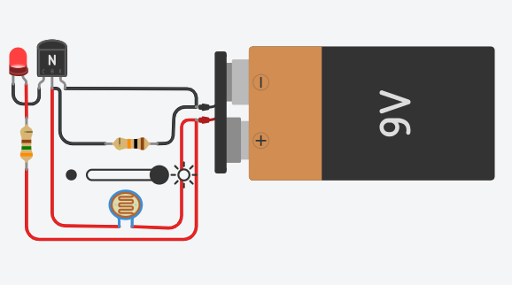

# Aula02

### Capacidades Técnicas
- 2 Identificar os tipos de hardwares e soluções disponíveis 

### Conhecimentos
- 2 Requisitos para Instalação 
  - 2.1 Hardware 
    - 2.1.1 Conectividade 
    - 2.1.2 Periféricos 
  - 2.2 Sensores e Atuadores 
    - 2.2.1 Interfaces de I/O 
    - 2.2.2 Analógica
- 5 Preparação de dispositivo IoT

## Trabalhando com mais alguns componentes

- Transistores
    - NPN
- Sensores
    - Fotoresistor
    - Botão (Pushbutton)

### Usando um transistor NPN (recomendado)
Os transistores amplificam a potência e podem atuar como interruptores eletricamente controlados. Os transistores de junção bipolar (BJTs, bipolar function transistors) possuem três camadas de silício, cuja disposição determina a direção do fluxo de corrente.
#### Como funciona
Os transistores amplificam a potência e podem atuar como interruptores eletricamente controlados. Os transistores de junção bipolar (BJTs, bipolar junction transistors) possuem três camadas de silício, cuja disposição determina a direção do fluxo de corrente.

#### Laboratório [ThinkerCad](https://www.tinkercad.com/)
Vamos montar um circuito semelhante ao dos postes da CPFL que a noite acendem a luz ee de dia a apagam com:

- 1 bateria de 9 V
- 1 LED
- 1 resistor de 330 Ω (para o LED)
- 1 fotoresistor (LDR)
- 1 resistor de 10 kΩ
- 1 transistor NPN (por exemplo, 2N2222 ou BC547)

##### Ligações
```
+9V
 │
 ├── Resistor 330 Ω ───► LED ─── Coletor (2N2222)
 │                               Emissor
 │                                  │
 │                                 GND
 │
 └── LDR ─────┐
              ├──── Base do transistor
Resistor 10k ─┘
      │
     GND
```

##### Como funciona
- Com muita luz:
    - A resistência do LDR diminui.
    - A tensão na base do transistor fica baixa.
    - O transistor conduz pouco.
    - O LED fica apagado ou fraco.
- No escuro:
    - A resistência do LDR aumenta.
    - A tensão na base aumenta.
    - O transistor conduz mais.
    - O LED acende mais forte.
- Se o comportamento ficar invertido no Tinkercad, basta trocar a posição do LDR e do resistor de 10 kΩ no divisor de tensão.