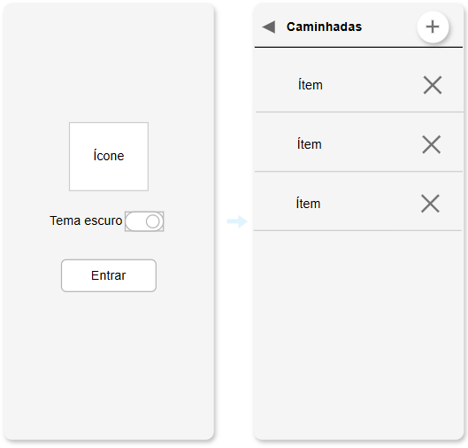
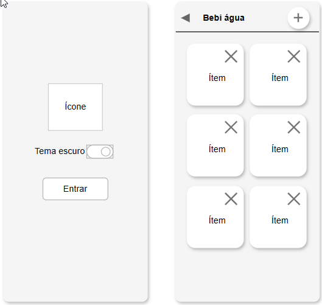

# Aula02 - Situações desafiadoras

|Elementos e funcionalidades|WidGets|
|-|:-:|
|Temas|ThemeData.light().copyWith() ThemeData.dark().copyWith()|
|Imagens|Image.asset(), Icon()|
|Assincronicidade, Estados|async, setState|
|Carregar e salvar dados em Arquivo local|path_provider|
|Conversão de dados, classe Modelo de MVC(Modelo, Visão e Controle)|.CSV|
|Botões de controle de conteúdos em tela|ElevatedButton()|
|Listas e / ou cards|ListView, Cards|

## Contextualização
Com o intúito de nos capacitar a desenvolver pequenos aplicativos de uso local com alguns recursos nativos do framework Flutter, desenvolva os aplicativos a seguir, como novos projetos.

## Desafio 01: Caminhadas x calorias
Desenvolva um aplicativo de histórico de caminhadas que armazene uma lista de caminhadas contendo os campos, [partida: String, chegada: String, distancia_em_km: double, peso_atual_kg: double] e que calcule o gasto calórico médio de **0.7 calorias por kilo** corporal e **km percorrido**.
#### Requisitos funcionais:

|Requisito|Descrição|Criticidade|
|-|-|-|
|[RF001]|O app deve ter uma tela "Splash" com um ícone, um botão trocar para tema escuro e um botão entrar.|[ ]Essencial [x]Importante [ ]Desejável|
|[RF002]|Uma tela "Home" com uma lista de registros de caminhadas, um botão "+" para adicionar e uma lixeira em cada item da lista para excluir o registro|[x]Essencial [ ]Importante [ ]Desejável|
|[RF003]|O app deve armazenar estes registros localmente no celular.|[x]Essencial [ ]Importante [ ]Desejável|
|[RF004]|Ao clicar em um ítem da lista abra um modal para alterar os dados.|[ ]Essencial [ ]Importante [x]Desejável|

#### Wireframes

## Desafio 02: Consumo de Água
Desenvolva um aplicativo de controle de consumo de água que armazene uma lista de registros contendo os campos [data: String, quantidade_em_ml: double, peso_atual_kg: double] e calcule a porcentagem da meta diária atingida, considerando uma recomendação média de 35 ml por kg corporal.

#### Requisitos funcionais:
|Requisito|Descrição|Criticidade|
|-|-|-|
|[RF001]|O app deve ter uma tela "Splash" com um ícone, um botão trocar para tema escuro e um botão entrar.|[ ]Essencial [x]Importante [ ]Desejável|
|[RF002]|Uma tela "Home" com uma lista em formato de cartões de registros de consumo de água, um botão "+" para adicionar e uma lixeira em cada item da lista para excluir o registro.|[x]Essencial [ ]Importante [ ]Desejável|
|[RF003]|O aplicativo deve exibir o total consumido no dia e a porcentagem da meta diária atingida.|[x]Essencial [ ]Importante [ ]Desejável|
|[RF004]|O app deve armazenar estes registros localmente no celular.|[x]Essencial [ ]Importante [ ]Desejável|
|[RF005]|Ao clicar em um item da lista abra um modal para alterar os dados.|[ ]Essencial [ ]Importante [x]Desejável|

#### Wireframes

## Desafio 03: Abastecimento de Veículos

Desenvolva um aplicativo de histórico de abastecimentos que armazene uma lista contendo os campos [posto: String, litros: double, valor_pago: double, quilometragem: double] e calcule o preço médio por litro e o consumo médio do veículo (km/L) considerando o abastecimento anterior.

#### Requisitos funcionais:
|Requisito|Descrição|Criticidade|
|-|-|-|
|[RF001]|O app deve ter uma tela "Splash" com um ícone, um botão trocar para tema escuro e um botão entrar.|[ ]Essencial [x]Importante [ ]Desejável|
|[RF002]|Uma tela "Home" com uma lista de abastecimentos, um botão "+" para adicionar e uma lixeira em cada item da lista para excluir o registro.|[x]Essencial [ ]Importante [ ]Desejável|
|[RF003]|O aplicativo deve exibir o custo médio por litro e o consumo médio do veículo (km/L).|[x]Essencial [ ]Importante [ ]Desejável|
|[RF004]|O app deve armazenar estes registros localmente no celular.|[x]Essencial [ ]Importante [ ]Desejável|
|[RF005]|Ao clicar em um item da lista abra um modal para alterar os dados.|[ ]Essencial [ ]Importante [x]Desejável|
#### Wireframes
Semelhante ao do primeiro desafio