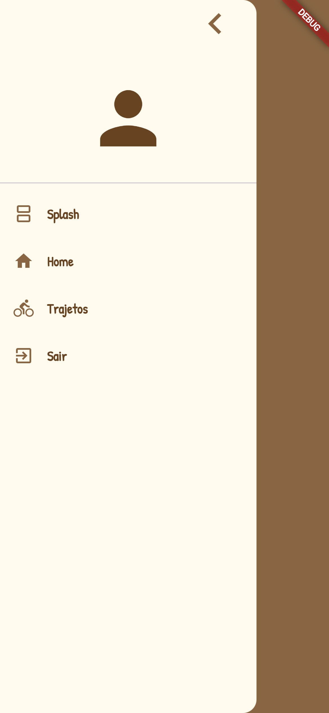
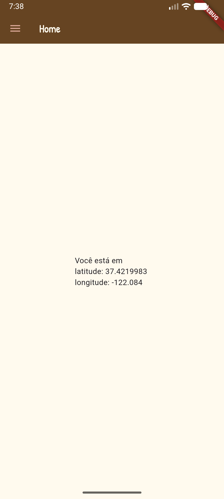

# Aula03

## Capacidades técnicas
- 5 Projetar interfaces para dispositivos móveis
- 6 Implementar o código respeitando as características da linguagem na plataforma mobile 

## Conhecimentos
- 2 Criação de interface 
  - 2.1 Leiaute de tela 
    - 2.1.1 Estrutura 
    - 2.1.2 Tipos 
    - 2.1.3 Gerenciadores 
    - 2.1.4 Componentes de tela 
    - 2.1.5 Menu 
- 3 Recursos de hardware 
  - 3.1 Bluetooth 
  - 3.2 GPS 
  - 3.3 Wifi 
  - 3.4 Acelerômetro 
  - 3.5 Multimídia 
    - 3.5.1 Áudio 
    - 3.5.2 Câmera

## Menu sadwish
Para criar um menu sanduíche (conhecido como Drawer no Flutter) que navega entre telas e possui um botão para sair do aplicativo, utilize o widget **Scaffold** com a propriedade **drawer** combinada com ListView e ListTile para os ítens do menu com Navigator.push() ou Navigator.pushReplacement() para navegar entre as telas.
- SystemNavigator.pop() para fechar o app.
- ListView e ListTile para os ítens do menu
- Navigator.push() ou Navigator.pushReplacement() para navegar entre as telas.
- Abaixo segue um exemplo de uma pagina `home.dart` com menu para navegar para outras duas telas (splash.dart e trajetos.dart) e fechar o aplicativo.

```dart
import 'package:flutter/material.dart';
import 'package:flutter/services.dart';
import 'splash.dart';
import 'trajetos.dart';

class Home extends StatefulWidget {
  const Home({super.key});

  @override
  State<Home> createState() => _HomeState();
}

class _HomeState extends State<Home> {
  @override
  Widget build(BuildContext context) {
    return Scaffold(
      appBar: AppBar(title: Text("Home")),
      drawer: Drawer(
        child: ListView(
          padding: EdgeInsets.zero,
          children: [
            ListTile(
              trailing: Icon(Icons.chevron_left, size: 50),
              onTap: () => Navigator.pop(context),
            ),
            DrawerHeader(child: Icon(Icons.person, size: 100)),
            ListTile(
              leading: Icon(Icons.splitscreen),
              title: Text('Splash'),
              onTap: () => Navigator.pushReplacement(
                context,
                MaterialPageRoute(builder: (context) => Splash()),
              ),
            ),
            ListTile(
              leading: Icon(Icons.home),
              title: Text('Home'),
              onTap: () => Navigator.pop(context),
            ),
            ListTile(
              leading: Icon(Icons.directions_bike),
              title: Text('Trajetos'),
              onTap: () => Navigator.pushReplacement(
                context,
                MaterialPageRoute(builder: (context) => Trajetos()),
              ),
            ),
            ListTile(
              leading: Icon(Icons.exit_to_app),
              title: Text('Sair'),
              onTap: () => SystemNavigator.pop(),
            ),
          ],
        ),
      ),
      body: Center(child: Text("Home")),
    );
  }
}

```


## Geolocalização
### Passos para implementar a geolocalização.
- 1 Adicionar a dependênciaAdicione o pacote no arquivo **pubspec.yaml** do seu projeto:
```yaml
dependencies:
  flutter:
    sdk: flutter
  geolocator: ^13.0.2
```
- 2 Configurar as permissões nativas
  - Android (android/app/src/main/AndroidManifest.xml):
    - Adicione antes da tag `<application>`
```xml
<uses-permission android:name="android.permission.ACCESS_FINE_LOCATION" />
<uses-permission android:name="android.permission.ACCESS_COARSE_LOCATION" />
```
  - iOS (ios/Runner/Info.plist):
    - Adicione dentro da tag <dict> principal:
```xml
<key>NSLocationWhenInUseUsageDescription</key>
<string>Precisamos da sua localização para mostrar sua posição no app.</string>
```
Segue o exemplo de uma função assíncrona que valida os serviços, pede permissão e captura as coordenadas.
```dart
import 'package:geolocator/geolocator.dart';

Future<Position?> obterCoordenadasGPS() async {
  bool servicoAtivo;
  LocationPermission permissao;

  // Verifica se o GPS está ligado no celular
  servicoAtivo = await Geolocator.isLocationServiceEnabled();
  if (!servicoAtivo) {
    return Future.error('O serviço de localização está desativado.');
  }

  // Verifica o status da permissão
  permissao = await Geolocator.checkPermission();
  if (permissao == LocationPermission.denied) {
    permissao = await Geolocator.requestPermission();
    if (permissao == LocationPermission.denied) {
      return Future.error('Permissão de localização negada.');
    }
  }

  if (permissao == LocationPermission.deniedForever) {
    return Future.error('Permissão negada permanentemente. Altere nas configurações.');
  }

  // Retorna a posição atual
  Position position = await Geolocator.getCurrentPosition(
    desiredAccuracy: LocationAccuracy.high,
  );
  
  print("Latitude: ${position.latitude}, Longitude: ${position.longitude}");
  return position;
}
```
A seguir um exemplo no mesmo arquivo `home.dart` com o menu e utilizando a função para obter a localização, latitude e longitude:
```dart
import 'package:flutter/material.dart';
import 'package:flutter/services.dart';
import 'package:geolocator/geolocator.dart';

import 'splash.dart';
import 'trajetos.dart';

class Home extends StatefulWidget {
  const Home({super.key});

  @override
  State<Home> createState() => _HomeState();
}

class _HomeState extends State<Home> {
  String latitude = "";
  String longitude = "";
  Position? p;

  @override
  initState() {
    obterCoordenadasGPS();
    super.initState();
  }

  @override
  Widget build(BuildContext context) {
    return Scaffold(
      appBar: AppBar(title: Text("Home")),
      drawer: Drawer(
        child: ListView(
          padding: EdgeInsets.zero,
          children: [
            ListTile(
              trailing: Icon(Icons.chevron_left, size: 50),
              onTap: () => Navigator.pop(context),
            ),
            DrawerHeader(child: Icon(Icons.person, size: 100)),
            ListTile(
              leading: Icon(Icons.splitscreen),
              title: Text('Splash'),
              onTap: () => Navigator.pushReplacement(
                context,
                MaterialPageRoute(builder: (context) => Splash()),
              ),
            ),
            ListTile(
              leading: Icon(Icons.home),
              title: Text('Home'),
              onTap: () => Navigator.pop(context),
            ),
            ListTile(
              leading: Icon(Icons.directions_bike),
              title: Text('Trajetos'),
              onTap: () => Navigator.pushReplacement(
                context,
                MaterialPageRoute(builder: (context) => Trajetos()),
              ),
            ),
            ListTile(
              leading: Icon(Icons.exit_to_app),
              title: Text('Sair'),
              onTap: () => SystemNavigator.pop(),
            ),
          ],
        ),
      ),
      body: Center(
        child: Text(
          'Você está em \nlatitude: $latitude \nlongitude: $longitude',
        ),
      ),
    );
  }

  Future<void> obterCoordenadasGPS() async {
    bool servicoAtivo;
    LocationPermission permissao;

    servicoAtivo = await Geolocator.isLocationServiceEnabled();
    if (!servicoAtivo) {
      return Future.error('O serviço de localização está desativado.');
    }

    permissao = await Geolocator.checkPermission();
    if (permissao == LocationPermission.denied) {
      permissao = await Geolocator.requestPermission();
      if (permissao == LocationPermission.denied) {
        return Future.error('Permissão de localização negada.');
      }
    }

    if (permissao == LocationPermission.deniedForever) {
      return Future.error(
        'Permissão negada permanentemente. Altere nas configurações.',
      );
    }

    Position position = await Geolocator.getCurrentPosition(
      locationSettings: LocationSettings(),
    );

    setState(() {
      latitude = position.latitude.toString();
      longitude = position.longitude.toString();
    });
  }
}
```


## Habilitando a Câmera
Capturar uma foto com a câmera, salvá-la na galeria do celular e exibi-la no corpo de um Scaffold em Flutter.
- Pacote image_picker (para abrir a câmera)
- Pacote gal ou gallery_saver_plus (para salvar nas imagens do dispositivo).
- O código abaixo implementa essa solução completa.
- **pubspec.yaml**
```yaml
dependencies:
  flutter:
    sdk: flutter
  image_picker: ^1.1.2
  gal: ^2.2.1 # ou gallery_saver_plus
  path_provider: ^2.1.4
```
#### Configurações Nativas Importantes
- **Android** (android/app/src/main/AndroidManifest.xml): O plugin gal lida bem com gravações modernas, mas certifique-se de testar em um aparelho físico (emuladores Android podem falhar dependendo da versão da API e ausência de câmera física)
- **iOS** (ios/Runner/Info.plist): Adicione a permissão para uso da câmera e acesso às fotos para evitar fechamentos forçados:
```xml
<key>NSCameraUsageDescription</key>
<string>Este aplicativo precisa acessar a câmera para tirar fotos.</string>
<key>NSPhotoLibraryAddUsageDescription</key>
<string>Este aplicativo precisa salvar fotos na sua galeria.</string>
```
- **main.dart**
```dart
import 'dart:io';
import 'package:flutter/material.dart';
import 'package:image_picker/image_picker.dart';
import 'package:gal/gal.dart';

void main() {
  runApp(const MyApp());
}

class MyApp extends StatelessWidget {
  const MyApp({super.key});

  @override
  Widget build(BuildContext context) {
    return const MaterialApp(
      debugShowCheckedModeBanner: false,
      home: HomeScreen(),
    );
  }
}

class HomeScreen extends StatefulWidget {
  const HomeScreen({super.key});

  @override
  State<HomeScreen> createState() => _HomeScreenState();
}

class _HomeScreenState extends State<HomeScreen> {
  File? _imageFile;
  final ImagePicker _picker = ImagePicker();

  Future<void> _takePhotoAndSave() async {
    try {
      // 1. Abrir a câmera para tirar a foto
      final XFile? pickedImage = await _picker.pickImage(
        source: ImageSource.camera,
        imageQuality: 80,
      );

      if (pickedImage == null) return;

      // 2. Salvar a foto na galeria de imagens do celular
      await Gal.putImage(pickedImage.path);

      // 3. Atualizar o estado para exibir a imagem no Scaffold
      setState(() {
        _imageFile = File(pickedImage.path);
      });

      if (!mounted) return;
      ScaffoldMessenger.of(context).showSnackBar(
        const SnackBar(content: Text('Foto salva na galeria e exibida!')),
      );
    } catch (e) {
      ScaffoldMessenger.of(context).showSnackBar(
        SnackBar(content: Text('Erro ao tirar ou salvar foto: $e')),
      );
    }
  }

  @override
  Widget build(BuildContext context) {
    return Scaffold(
      appBar: AppBar(title: const Text('Câmera no Flutter')),
      body: Center(
        child: _imageFile == null
            . ? const Text('Nenhuma foto tirada ainda.')
            : Image.file(
                _imageFile!,
                height: 400,
                fit: BoxFit.cover,
              ),
      ),
      floatingActionButton: FloatingActionButton(
        onPressed: _takePhotoAndSave,
        child: const Icon(Icons.camera_alt),
      ),
    );
  }
}
```
## Exemplo [flutter_pedal](https://github.com/wellifabio/sesi_ppdm2_flutter_pedal_gps_2026.git)


