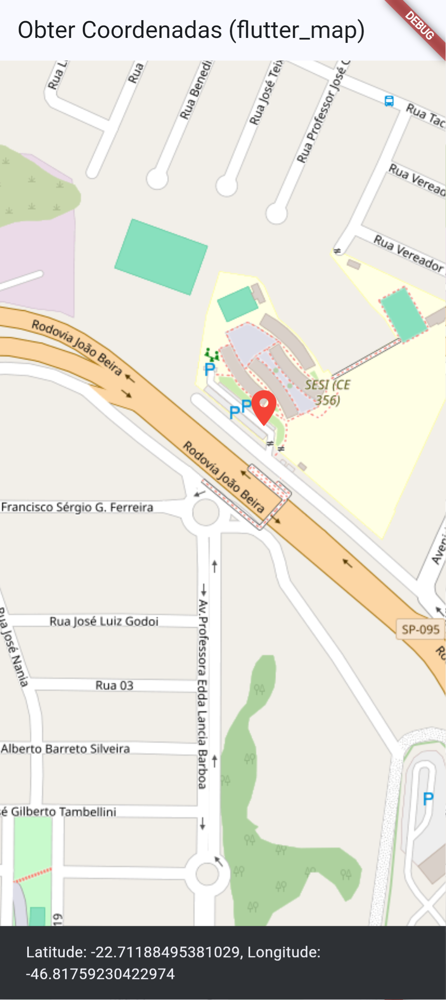

# Flutter Map
- [flutter_map](https://pub.dev/packages/flutter_map) é um pacote gratuito e open source para Flutter que permite a integração de mapas em aplicativos móveis. Ele é baseado na biblioteca Leaflet.js, que é amplamente utilizada para criar mapas interativos na web.
- O pacote `flutter_map` oferece uma ampla gama de recursos, incluindo suporte para diferentes provedores de mapas, camadas personalizadas, marcadores, pop-ups e muito mais. Ele é altamente configurável e permite que os desenvolvedores criem experiências de mapa ricas e interativas em seus aplicativos Flutter.
- Para começar a usar o `flutter_map`, você precisa adicioná-lo ao seu arquivo `pubspec.yaml` e importar o pacote em seu código Dart. Em seguida, você pode criar um widget `FlutterMap` e configurar as opções de mapa, como a posição inicial, o nível de zoom e as camadas de mapa que deseja exibir.
- O `flutter_map` é uma excelente escolha para desenvolvedores Flutter que desejam adicionar funcionalidades de mapa aos seus aplicativos de forma rápida e fácil, sem a necessidade de depender de serviços pagos ou proprietários.

## Tutorial para obter Latitude e Longitude de um endereço
- Instalar as dependências necessárias no arquivo `pubspec.yaml`:
```yaml
dependencies:
  flutter_map: ^3.0.0
  latlong2: ^0.8.2
```
- Por linha de comando:
```bash
flutter pub add flutter_map latlong2
flutter pub get
```
- Ou Adicione o flutter_map e o latlong2 (pacote necessário para manipular coordenadas geográficas neste plugin) ao seu projeto. No terminal, execute:
```bash
flutter pub add flutter_map latlong2
```
O código a seguir obtem a latitude e longitude de um endereço local clicado no mapa.
- Copie e cole no arquivo `lib/main.dart`
```dart
import 'package:flutter/material.dart';
import 'package:flutter_map/flutter_map.dart';
import 'package:latlong2/latlong.dart';

void main() {
  runApp(MyApp());
}

class MyApp extends StatelessWidget {
  const MyApp({super.key});

  @override
  Widget build(BuildContext context) {
    return MaterialApp(
      title: 'Obter Posição no Mapa',
      theme: ThemeData(
        colorScheme: ColorScheme.fromSeed(seedColor: Colors.blue),
        useMaterial3: true,
      ),
      home: MapScreenOSM(),
    );
  }
}

class MapScreenOSM extends StatefulWidget {
  const MapScreenOSM({super.key});

  @override
  State<MapScreenOSM> createState() => _MapScreenOSMState();
}

class _MapScreenOSMState extends State<MapScreenOSM> {
  LatLng? _pontoClicado;

  @override
  Widget build(BuildContext context) {
    return Scaffold(
      appBar: AppBar(title: Text('Obter Coordenadas (flutter_map)')),
      body: FlutterMap(
        options: MapOptions(
          initialCenter: LatLng(-22.7130000,-46.8180000), // SESI Amparo
          initialZoom: 17.0,
          onTap: (tapPosition, latLng) {
            setState(() {
              _pontoClicado = latLng;
            });
            ScaffoldMessenger.of(context).showSnackBar(
              SnackBar(
                content: Text(
                  'Latitude: ${latLng.latitude}, Longitude: ${latLng.longitude}',
                ),
                duration: Duration(seconds: 3),
              ),
            );
          },
        ),
        children: [
          TileLayer(
            urlTemplate: 'https://tile.openstreetmap.org/{z}/{x}/{y}.png',
            userAgentPackageName: 'com.example.flutter_obter_posicao_map',
          ),
          if (_pontoClicado != null)
            MarkerLayer(
              markers: [
                Marker(
                  point: _pontoClicado!,
                  width: 40,
                  height: 40,
                  child: Icon(
                    Icons.location_on,
                    color: Colors.red,
                    size: 40,
                  ),
                ),
              ],
            ),
        ],
      ),
    );
  }
}
```
- Execute o App em um emulador ou navegador.
```bash
flutter pub get
flutter run
```

|Resultado|Conclusão|
|-|-|
||O código acima cria um aplicativo Flutter que exibe um mapa usando o pacote `flutter_map`.<br> - Quando o usuário clica em um ponto do mapa, a latitude e longitude desse ponto são capturadas e exibidas no console.<br> - Além disso, um marcador é adicionado ao ponto clicado para indicar visualmente a localização|