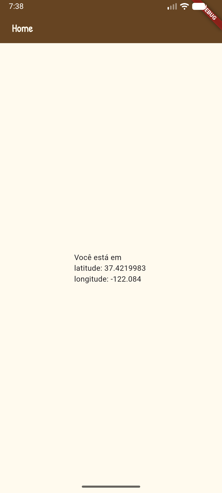

## Geolocalização GPS
Obter dados do sensor GPS do aparelho celular.
- Funciona também no navegador Google Chrome
### Passos para implementar a geolocalização.
- 1 Adicionar a dependênciaAdicione o pacote no arquivo **pubspec.yaml** do seu projeto:
```bash
flutter pub add geolocator
flutter pub get
```
- pubspec.yaml
```yaml
dependencies:
  flutter:
    sdk: flutter
  geolocator: ^13.0.2
```
- 2 Configurar as permissões nativas
  - Android (android/app/src/main/AndroidManifest.xml):
    - Adicione antes da tag `<application>`
```xml
<uses-permission android:name="android.permission.ACCESS_FINE_LOCATION" />
<uses-permission android:name="android.permission.ACCESS_COARSE_LOCATION" />
```
  - iOS (ios/Runner/Info.plist):
    - Adicione dentro da tag <dict> principal:
```xml
<key>NSLocationWhenInUseUsageDescription</key>
<string>Precisamos da sua localização para mostrar sua posição no app.</string>
```
## Exemplo de um app com a estrutura
```
lib
    main.dart
    home.dart
```
- Arquivo `main.dart`
```dart
import 'package:flutter/material.dart';
import 'home.dart';

void main() {
  runApp(MaterialApp(
      title: 'Obter sua localização',
      home: Home(),
    ));
}
```
- Arquivo `lib/home.dart` utilizando a função para obter a localização, latitude e longitude:
```dart
import 'package:flutter/material.dart';
import 'package:flutter/services.dart';
import 'package:geolocator/geolocator.dart';

import 'splash.dart';
import 'trajetos.dart';

class Home extends StatefulWidget {
  const Home({super.key});

  @override
  State<Home> createState() => _HomeState();
}

class _HomeState extends State<Home> {
  String latitude = "";
  String longitude = "";
  Position? p;

  @override
  initState() {
    obterCoordenadasGPS();
    super.initState();
  }

  @override
  Widget build(BuildContext context) {
    return Scaffold(
      appBar: AppBar(title: Text("Home")),
      body: Center(
        child: Text(
          'Você está em \nlatitude: $latitude \nlongitude: $longitude',
        ),
      ),
    );
  }

  Future<void> obterCoordenadasGPS() async {
    bool servicoAtivo;
    LocationPermission permissao;

    servicoAtivo = await Geolocator.isLocationServiceEnabled();
    if (!servicoAtivo) {
      return Future.error('O serviço de localização está desativado.');
    }

    permissao = await Geolocator.checkPermission();
    if (permissao == LocationPermission.denied) {
      permissao = await Geolocator.requestPermission();
      if (permissao == LocationPermission.denied) {
        return Future.error('Permissão de localização negada.');
      }
    }

    if (permissao == LocationPermission.deniedForever) {
      return Future.error(
        'Permissão negada permanentemente. Altere nas configurações.',
      );
    }

    Position position = await Geolocator.getCurrentPosition(
      locationSettings: LocationSettings(),
    );

    setState(() {
      latitude = position.latitude.toString();
      longitude = position.longitude.toString();
    });
  }
}
```
### Resultado
