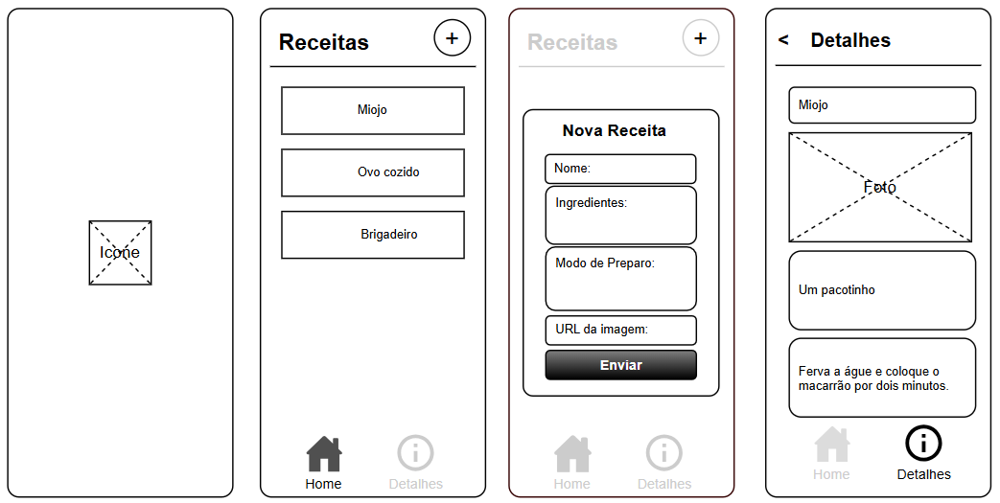

# Aula06 - App com dados de uma API própria

Consumir dados de uma API Back-end própria com um app Flutter

---
## [Exemplo App TehcMAN](https://github.com/wellifabio/flutter_techman_2025.git)
---

## Passos
- 1 Implante sua API na [Vercel(Aula03 de projetos)](../../05-psof3/aula03/README.md) ou outro serviço de nuvem.
- 2 Acrescente no seu App as dependência `http` para consumir dados da sua API e `shared_preferences` para compartilhar entre as telas:

```bash
flutter pub add http
flutter pub add shared_preferences
flutter pub get
```
- Confira o arquivo `pubspec.yaml`:

```yaml
dependencies:
  flutter:
    sdk: flutter
  http: ^1.1.0
  shared_preferences: ^2.2.2
```
- 3 Acrescente a linha a seguir no arquivo `./android/app/src/main/AndroidManifest.xml` antes da tag `<application>` para que as permissões de internet sejam habilitadas a API responda.

```xml
<uses-permission android:name="android.permission.INTERNET"/>
```

- 4 Desenvolva e teste seu **App**, ao concluir gere o `.APK` para instalar e testar em um aparelho Android.

## Livro de Receitas
Projeto Mobile (Flutter) com Full Stack
- API de um livro de Receitas implantada na **Vercel** [https://receitasapi-b-2025.vercel.app/](https://receitasapi-b-2025.vercel.app/)
- Repositório da API no [Github](https://github.com/wellifabio/receitasapp-expo-2025.git)
- [Front End do livro de Receitas](https://wellifabio.github.io/receitas-web-2025/) consumindo a API
- Repositório do Front-End no [Github](https://github.com/wellifabio/receitasapi-b-2025)

### Desafio!
Crie um aplicativo de um livro de receitas que consuma esta API, modele semelhante ao wireframe abaixo, aplique tema, splash screen com animação e um design profissional.
<br>

### Entrega
- Envie para o Github com o arquivo [APK](../aula02/README.md) na pasta assets.
- Apresente o **App** ao instrutor em um aparelho celular Android, utilize um dos dispositivos disponibilizados pelo SESI.

### Tutorial
- 1 Criar um novo projeto Flutter
- 2 Instalar as dependências
```bash
flutter pub add http
flutter pub add shared_preferences
flutter pub add flutter_launcher_icons --dev
flutter pub get
```
- 3 Acrescente a linha a seguir no arquivo `./android/app/src/main/AndroidManifest.xml` antes da tag `<application>` 
```xml
<uses-permission android:name="android.permission.INTERNET"/>
```
- 4 Crie a seguinte estrutura de pastas em lib
```
lib
  ui
    style
      colors.dart
      theme.dart
    detalhes.dart
    home.dart
    splash.dart
  api.dart
  main.dart
```
- 5 Crie uma pasta `assets` em seu aplicativo
  - baixe o [icone.png](./icone.png) do aplicativo dentro dela
  - dentro de assets crie uma pasta fonts `assets/fonts` e baixe a font [PatrickHand-Regular.ttf](./PatrickHand-Regular.ttf) para dentro dela
```
assets
  fonts
    PatrickHand-Regular.ttf
  icone.png
```
  - acrescente os caminhos e confira o `pubspec.yaml` conforme modelo a seguir:
```yaml
dependencies:
  flutter:
    sdk: flutter
  http: ^1.6.0
  shared_preferences: ^2.5.6

dev_dependencies:
  flutter_test:
    sdk: flutter
  flutter_lints: ^6.0.0
  flutter_launcher_icons: ^0.14.4

flutter_launcher_icons:
  android: true
  ios: true
  image_path: "assets/icone.png"
  remove_alpha_ios: true

flutter:
  uses-material-design: true
  assets:
    - assets/
  fonts:
    - family: PatrickHand
      fonts:
        - asset: assets/fonts/PatrickHand-Regular.ttf
```
- 6 Execute os seguinte comando no terminal do VsCode para configurar o logo:
```bash
flutter pub get
flutter pub run flutter_launcher_icons:main
```
#### Desenvolvendo as telas
- main.dart
```dart
import 'package:flutter/material.dart';

import 'ui/splash.dart';
import 'ui/style/theme.dart';

void main() {
  runApp(
    MaterialApp(
      title: "Anotações",
      theme: AppTheme.temaClaro,
      darkTheme: AppTheme.temaEscuro,
      themeMode: ThemeMode.system,
      home: Splash(),
    ),
  );
}
```
- api.dart
```dart
class Api {
  static String baseUrl = 'https://receitasapi-b-2025.vercel.app/';
  static String getEndPoint(String endpoint) {
    return '$baseUrl$endpoint';
  }
}
```
- ui/style/colors.dart
```dart
import 'package:flutter/material.dart';

abstract class AppColors {
  static const Color c1 = Color(0xFF664422);
  static const Color c2 = Color(0xFF886644);
  static const Color c3 = Color(0xFFBB9988);
  static const Color c4 = Color(0xFFDDAA99);
  static const Color c5 = Color(0xFFFFFAEE);
}
```
- ui/style/theme.dart
```dart
import 'package:flutter/material.dart';

import 'colors.dart';

abstract class AppTheme {
  static ThemeData temaClaro = ThemeData.light().copyWith(
    scaffoldBackgroundColor: AppColors.c5,
    primaryColor: AppColors.c1,
    drawerTheme: DrawerThemeData(
      backgroundColor: AppColors.c5,
      scrimColor: AppColors.c2,
    ),
    iconTheme: IconThemeData(color: AppColors.c1),
    floatingActionButtonTheme: FloatingActionButtonThemeData(
      backgroundColor: AppColors.c1,
      foregroundColor: AppColors.c5,
      shape: CircleBorder(),
    ),
    appBarTheme: AppBarTheme(
      backgroundColor: AppColors.c1,
      foregroundColor: AppColors.c4,
      titleTextStyle: TextStyle(
        color: AppColors.c5,
        fontSize: 20,
        fontWeight: FontWeight.bold,
        fontFamily: 'PatrickHand',
      ),
    ),
    elevatedButtonTheme: ElevatedButtonThemeData(
      style: ElevatedButton.styleFrom(
        backgroundColor: AppColors.c1,
        foregroundColor: AppColors.c5,
        textStyle: TextStyle(
          fontSize: 16,
          fontWeight: FontWeight.bold,
          fontFamily: 'PatrickHand',
        ),
      ),
    ),
    dialogTheme: DialogThemeData(
      backgroundColor: AppColors.c5,
      titleTextStyle: TextStyle(
        color: AppColors.c1,
        fontSize: 20,
        fontWeight: FontWeight.bold,
        fontFamily: 'PatrickHand',
      ),
      contentTextStyle: TextStyle(
        color: AppColors.c1,
        fontSize: 16,
        fontFamily: 'PatrickHand',
      ),
    ),
    listTileTheme: ListTileThemeData(
      textColor: AppColors.c1,
      iconColor: AppColors.c2,
      style: ListTileStyle.list,
      titleTextStyle: TextStyle(
        color: AppColors.c1,
        fontSize: 16,
        fontWeight: FontWeight.bold,
        fontFamily: 'PatrickHand',
      ),
    ),
  );
  static ThemeData temaEscuro = ThemeData.dark().copyWith(
    scaffoldBackgroundColor: AppColors.c1,
    primaryColor: AppColors.c5,
    drawerTheme: DrawerThemeData(
      backgroundColor: AppColors.c1,
      scrimColor: AppColors.c5,
    ),
    iconTheme: IconThemeData(color: AppColors.c5),
    floatingActionButtonTheme: FloatingActionButtonThemeData(
      backgroundColor: AppColors.c5,
      foregroundColor: AppColors.c1,
      shape: CircleBorder(),
    ),
    appBarTheme: AppBarTheme(
      backgroundColor: AppColors.c5,
      foregroundColor: AppColors.c2,
      titleTextStyle: TextStyle(
        color: AppColors.c1,
        fontSize: 20,
        fontWeight: FontWeight.bold,
        fontFamily: 'PatrickHand',
      ),
    ),
    elevatedButtonTheme: ElevatedButtonThemeData(
      style: ElevatedButton.styleFrom(
        backgroundColor: AppColors.c5,
        foregroundColor: AppColors.c1,
        textStyle: TextStyle(
          fontSize: 16,
          fontWeight: FontWeight.bold,
          fontFamily: 'PatrickHand',
        ),
      ),
    ),
    dialogTheme: DialogThemeData(
      backgroundColor: AppColors.c1,
      titleTextStyle: TextStyle(
        color: AppColors.c5,
        fontSize: 20,
        fontWeight: FontWeight.bold,
        fontFamily: 'PatrickHand',
      ),
      contentTextStyle: TextStyle(
        color: AppColors.c5,
        fontSize: 16,
        fontFamily: 'PatrickHand',
      ),
    ),
    listTileTheme: ListTileThemeData(
      textColor: AppColors.c5,
      iconColor: AppColors.c4,
      style: ListTileStyle.list,
      titleTextStyle: TextStyle(
        color: AppColors.c5,
        fontSize: 16,
        fontWeight: FontWeight.bold,
        fontFamily: 'PatrickHand',
      ),
    ),
  );
}
```
- ui/detalhes.dart
```dart
```
- ui/home.dart
```dart
```
- ui/splash.dart
```dart
import 'package:flutter/material.dart';

import 'home.dart';

class Splash extends StatefulWidget {
  const Splash({super.key});

  @override
  State<Splash> createState() => _SplashState();
}

class _SplashState extends State<Splash> with TickerProviderStateMixin {
  late AnimationController aumentar;
  double tamanho = 0;

  @override
  void initState() {
    super.initState();
    animacao();
  }

  void animacao() {
    aumentar = AnimationController(vsync: this, duration: Duration(seconds: 2))
      ..addListener(() {
        setState(() {
          tamanho = aumentar.value;
        });
      });
    aumentar.forward().then((value) => irParaHome());
  }

  void irParaHome() async {
    await Navigator.pushReplacement(
      context,
      MaterialPageRoute(builder: (context) => Home()),
    );
  }

  @override
  Widget build(BuildContext context) {
    return Scaffold(
      body: Center(
        child: Transform.scale(
          scale: tamanho,
          child: Image.asset("assets/icone.png", width: 300),
        ),
      ),
    );
  }
}
```
- Salve e execute no navegador ou emulador
```bash
flutter pub get
flutter run
```