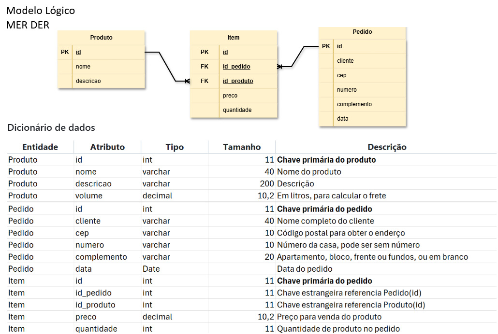

# Aula02 - Recursos avançados

## Criando Full-Stack com a dependência do prof Reenye na API
#### 1 Criar uma pasta para o Projeto e Abrir com VsCode
- Instalar globalmente a dependência backend-aula
```bash
npm i -g backend-aula
```
- 1 iniciar um novo backend
```bash
npx backend-aula backend
```
#### 2 Alterar o nome do banco de dados no arquivo **.env**
```js
PORT=3000
DATABASE_URL="mysql://root@localhost:3306/mydb"
```
de 
```js
PORT=3000
DATABASE_URL="mysql://root@localhost:3306/pedidos_exemplo"
```
#### 3 Editar o prisma/schema.prisma adicionando os models (tabelas e relacionamentos)
```js
generator client {
  provider = "prisma-client-js"
}

datasource db {
  provider = "mysql"
}

model produto {
  id        Int    @id @default(autoincrement())
  nome      String
  descricao String
  imagem    String?
  itens     item[]
}

model pedido {
  id          Int      @id @default(autoincrement())
  cliente     String
  cep         String
  numero      String
  complemento String
  data        DateTime @default(now())
  itens       item[]
}

model item {
  id         Int @id @default(autoincrement())
  pedidoId   Int
  produtoId  Int
  quantidade Int

  pedido  pedido  @relation(fields: [pedidoId], references: [id])
  produto produto @relation(fields: [produtoId], references: [id])
}
```
- Esquema criado com base no MER abaixo:

#### 4 Se usar o XAMPP, abrir o Control Panel e dar **start** em MySQL, se usa o MariaDB diretamente, apenas instalar as dependências do **prisma**
- Acesse a pasta API e rode os comandos abaixo:
```bash
cd backend
npx prisma generate
npx prisma migrate dev --name init
```
- Caso de algum erro pode ser que seu banco já exista corrija com os comandos
```bash
npm i
npx prisma migrate reset
```
- Se o erro for de versão do prisma, atualize com o comando
```bash
npm i -g prisma
```
- ou remova e instale a versão 7
 ```bash
npm uninstall prisma @prisma/client
npm install prisma@7 @prisma/client@7
```
#### 5 Semear dados de teste no banco de dados
- Crie um arquivo chamado **seed.js** na pasta **api/prisma** com o conteúdo abaixo:
```js
const prisma = require('../src/data/prisma')

async function main() {
    await prisma.produto.createMany({
        data: [
            { nome: "Caneta Azul", descricao: "Caneta esferográfica azul" },
            { nome: "Caderno 100 folhas", descricao: "Caderno brochura 100 folhas" },
            { nome: "Lápis Preto", descricao: "Lápis preto nº 2" },
            { nome: "Borracha Branca", descricao: "Borracha branca macia" },
            { nome: "Mochila Escolar", descricao: "Mochila escolar com compartimentos" },
            { nome: "Estojo de Lápis", descricao: "Estojo de lápis com zíper" }
        ],
    })
    console.log('Produtos inseridos com sucesso!');
    await prisma.pedido.createMany({
        data: [
            { cliente: "Ana Silva", cep: "13914552", numero: "100", complemento: "Apto 101" },
            { cliente: "Carlos Oliveira", cep: "13905522", numero: "200" },
            { cliente: "Maria Santos", cep: "13476622", numero: "300", complemento: "Fundos" },
        ],
    })
    console.log('Pedidos inseridos com sucesso!');
    await prisma.item.createMany({
        data: [
            { pedidoId: 1, produtoId: 1, quantidade: 50 },
            { pedidoId: 2, produtoId: 2, quantidade: 15 },
            { pedidoId: 3, produtoId: 3, quantidade: 25 },
            { pedidoId: 1, produtoId: 1, quantidade: 10 },
            { pedidoId: 2, produtoId: 2, quantidade: 10 },
            { pedidoId: 3, produtoId: 3, quantidade: 5 },
        ],
    })
    console.log('Itens inseridos com sucesso!');
}

main()
    .catch(e => {
        console.error(e)
        process.exit(1)
    })
    .finally(async () => {
        await prisma.$disconnect()
    })
```
- Acrescente a referencia ao arquivo **seed: 'prisma/seed.js'** no arquivo **prisma.config.ts**
```js
import "dotenv/config";
import { defineConfig } from "prisma/config";

export default defineConfig({
  schema: "prisma/schema.prisma",
  migrations: {
    path: "prisma/migrations",
    seed: 'prisma/seed.js',
  },
  datasource: {
    url: process.env["DATABASE_URL"],
  },
});
```
- Acrescente o script de seed no package.json abaixo da sessão de scripts, ficando assim:
```json
  "prisma": {
    "seed": "node prisma/seed.js"
  }
```
- Execute o comando para semear os dados no banco de dados
```bash
npm install
npx prisma db seed
```
#### 6 Criar os controllers básicos (CRUD) e rotas, pare a execução do projeto, use o comando abaixo colocando o nome para cada tabela
```bash
npx backend-aula -models
# ou para criar apenas uma tabela por vez
npx backend-aula -r nometabela
```
#### 7 Criar o arquivo de testes do insomnia:
```bash
npx backend-aula -insomnia
```
#### 8 Execute o projeto e teste com insomnia
```bash
npm run dev
``` 
#### 9 Criar o arquivo **.gitignore** na raiz contendo o node_module e .env
```
node_module
.env
```