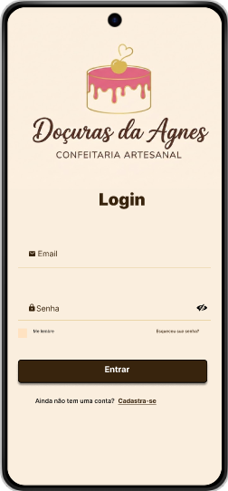
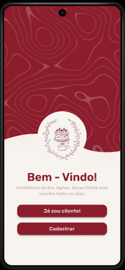
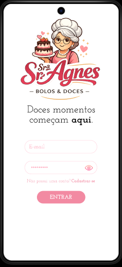

# Aula02 - Figma
Figma é uma ferramenta de criação de wireframes e protótipos

## Wireframes
São esboços / esqueletos de um projeto de aplicativo ou site, parte inicial de um projeto para nortear a equipe de desenvolvimento.

## Protótipos
Protótipos são demonstrações de produtos sites ou aplicativos já com algumas funcionalidades básicas de navegação e animação com o objetivo de validar com o cliente suas reais necessidades e até encantar novos clientes demonstrando as soluções propostas pela equipe.

## Demonstração prática
- Escreva Figma no google
- Acesse com uma conta do gmail
- Responda os questionamentos como estudante
- Clique em **Design** para iniciar um novo protótipo ou wireframe
    - Para criar uma tela, desenhem um retêngulo, clique com o botão direito do mouse **Add auto layout**
    - Em **prototype** esciolha um dispositivo, verifique suas dimenções (Largura e altura)
    - Configure seus layouts / telas com as mesmas dimenções e começe a prototipar.

## Desafio
Em grupos de até três integrantes

### Contextualização
A Sra. Agnes é uma excelente confeiteira está abrindo na cidade uma loja fízica e precisa de um aplicativo para divulgar e vender seus deliciosos bolos e doces.

## Desafio
Esboce um aplicativo com tela de login, cadastre-se, lista de produtos, detalhes dos produtos, botão para fazer pedido e tela para acompanhar seu pedido, comforme requisitos funcionais a seguir.

### [RF001]Tela de login
- 1.1 Logotipo e ou logomarca da loja
- 1.2 Campo para email
- 1.3 Campo para senha
- 1.4 Botão para entrar
- 1.5 Botão cadastre-se

### [RF002]Tela de Cadastro
- 2.1 Logotipo e ou logomarca da loja
- 2.2 Campo nome completo
- 2.3 Campo cep
- 2.4 Campo numero
- 2.5 Campo complemento
- 2.6 Campo para email
- 2.7 Campo para senha
- 2.8 Campo para confirmar senha
- 2.9 Botão registrar

### [RF003]Tela de listar produtos
- 3.1 Logotipo e ou logomarca da loja
- 3.2 lista contendo pelo menos 10 cards
    - 3.2.1 Nome do produto
    - 3.2.2 Foto (miniatura) do produto
    - 3.2.3 Preço do produto
- 3.2 Botão para sair do aplicativo

### [RF004]Tela de detalhes do produto
- 4.1 Nome do produto
- 4.2 Descrição do produto
- 4.3 Foto do produto em tamanho maior
- 4.4 Preço do produto
- 4.5 Botão para fazer o pedido

### [RF005]Tela de acompanhamento do pedido
- 5.1 Lista com pelo menos 3 cards de produtos
    - 5.1.1 Nome do produto
    - 5.1.2 Foto (miniatura) do produto
    - 5.1.3 Status do pedido (Em preparação, a caminho)

## Mais instruções
Pesquise as tendencias dos melhores aplicativos do mercado, crie uma identidade visual (Logotipo, logomarca e paleta de cores), coloque navegação entre telas e efeitos de transição de tela, entrada e saída de elementos.

## Entrega
Ao final envie o link do protótipo funcional do figma neste **[formulário](https://docs.google.com/forms/d/e/1FAIpQLScks_bvhmjNJUtJp2neIUdP5uW8Ng84zGV7CXDveVRG2w4cGA/viewform?usp=dialog)** com os nomes dos integrantes do grupo.
- Prepare uma apresentação no intuito de convencer o **cliente** a fechar contrato para a construção do seu aplicativo.

#### [Exemplo da estrutura](https://www.figma.com/design/5uvnEMO85cp3SIRbn85yjY/Union?node-id=2050-194&t=2VwYugBHcrC0rvHv-1)
#### [Exemplo de protótipo](https://www.figma.com/proto/5uvnEMO85cp3SIRbn85yjY/Union?t=hdXKrcbRz8bPZbhB-1&scaling=scale-down&content-scaling=fixed&page-id=0%3A1&node-id=2021-14&starting-point-node-id=2%3A2&show-proto-sidebar=1)

## Conclusão
Será feita uma votação pela outra sala escolhendo o melhor protótipo apresentado.
- [Enquete dos protótipos apresentados, escolha um projeto](https://forms.gle/GnvAk9FTLpkocqJT9)

|Resultados|Votos|
|-|-|
||[18](https://www.figma.com/proto/Xyqtb54BVsm6Q2DLZ7rZQJ/Prot%C3%B3tipo-PPDM?node-id=15-162&p=f&t=qMC413YSMYPLWI9r-1&scaling=scale-down&content-scaling=fixed&page-id=0%3A1&starting-point-node-id=15%3A162&show-proto-sidebar=1)|
||[15](https://www.figma.com/proto/o7ibio9zAp7c72CX7eI4DR/Sra.-Agnes?node-id=43-61&t=KXPpJKzQP6yGiWfC-1)|
||[6](https://www.figma.com/proto/JPVUuoXzpP43HObWswcZ0v/Untitled?node-id=2-14&p=f&t=pVLHJndsl9x6Wnme-1&scaling=scale-down&content-scaling=fixed&page-id=0%3A1&starting-point-node-id=2%3A14)|