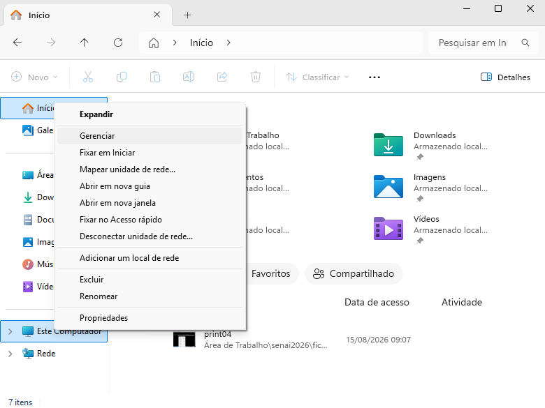
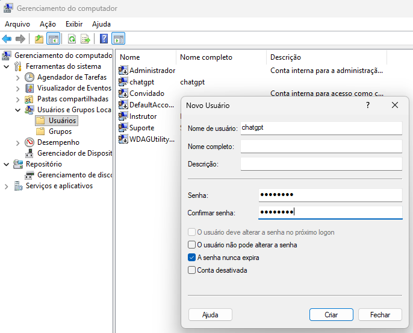
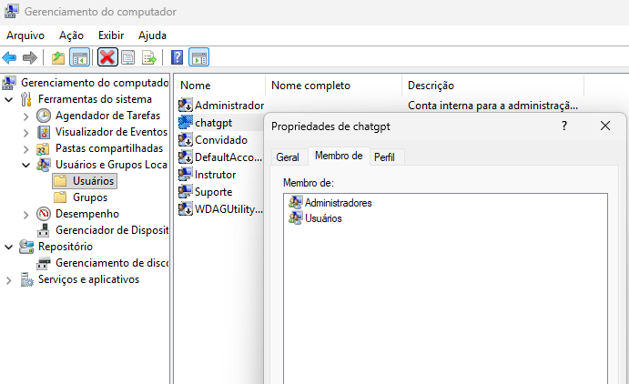
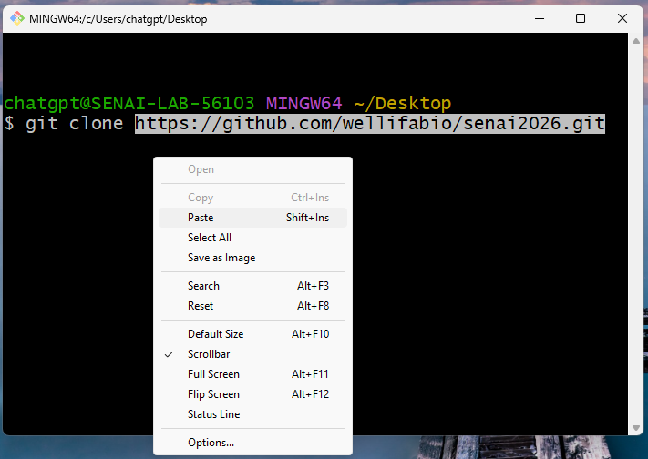
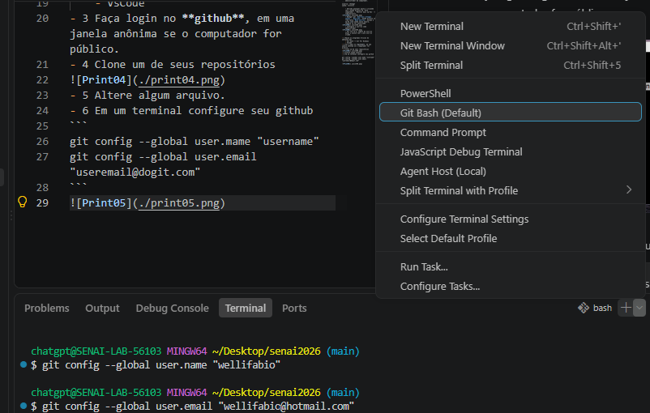
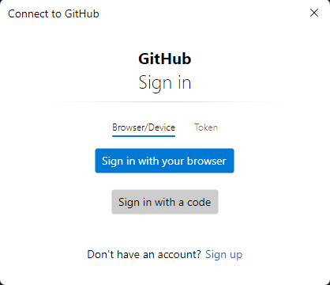

# Configurar novo ambiente DEV
Quando estamos usando uma nova estação de trabalho devemos configurar nosso ambiente DEV, se estação for compartilhada com outros usuários devemos:
- 1 Criar um novo usuário e definir como administrador exemplo:
    - Obs: Só é ppssível fazer este procedimento com um usuário que ja é administrador do computador.
```
usuario: chatgpt
senha: ********
```
    - Abrindo qualquer pasta e clicando com o botão direito em `Este computador`, `Mostrar mais opções` -> **Gerenciar**.

    - Navegar por `Usuários e Grupos Locais`, `Usuários`, botão direito na área vazia `Novo usuário`, marque a opção [x]A senha nunca expira, somente se for autorizado.

    - Configure o usuário como administrador

    - Por fim faça, logoff do usuário atual e acesse com o novo usuário criado.

- 2 Baixe os programas básicos do ambiente dev
    - Git bash -> Git For Windows
    - VsCode
- 3 Faça login no **github**, em uma janela anônima se o computador for público.
- 4 Clone um de seus repositórios

- 5 Altere algum arquivo.
- 6 Em um terminal configure seu github
```bash
git config --global user.mame "username"
git config --global user.email "useremail@dogit.com"
```

- 7 Faça um novo commit
```bash
git add .
git commit -m "novo ambiente configurado"
git push
```

- Copie e cole a URL em uma nova aba anônima para autenticar. 