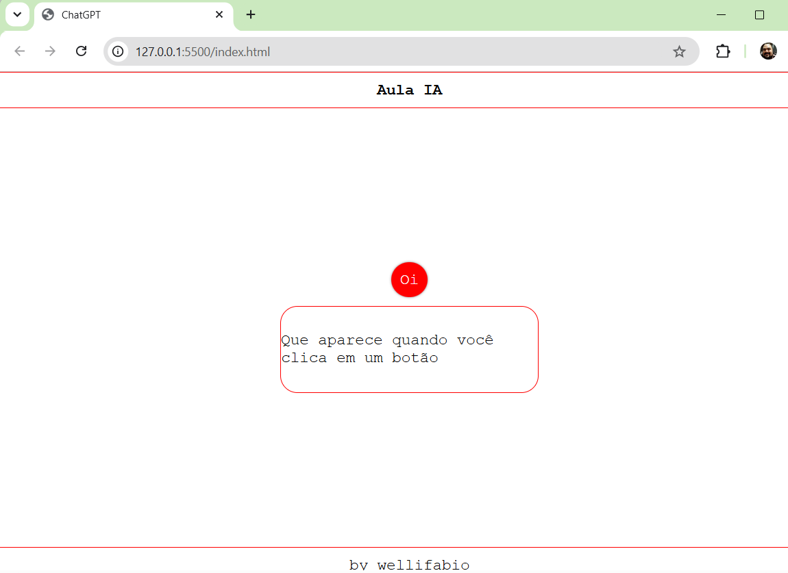

# Aula01

## Atividades realizadas:
- 1 Apresentação da instituição SENAI;
- 2 Emails educacionais dos alunos;
- 3 Apresentação do curso e do professor;
- 4 Apresentação dos alunos;
- 5 Cadastro na ferramenta de versionamento de código (**GitHub**);
- 6 Preparação do ambiente de desenvolvimento;
    - 6.1 Instalação do **Visual Studio Code**;
    - 6.2 Instalação do **Git for Windows**;
    - 6.3 Configuração do **Git**;
- 7 Apresentação do conteúdo programático do curso;
- 8 Apresentação do plano de ensino;

## Atividade prática:
- Criar uma página Web simples utilizando HTML, CSS e JavaScript, e enviar o código para o GitHub, utilizando o controle de versão do Git.

### Falso chatbot com respostas pré-definidas e aleatórias.
- 1 Crie uma pasta na área de trabalho com o nome de "Chatbot";
- 2 Dentro da pasta "Chatbot", crie um arquivo HTML com o nome de "index.html";
- 3 Dentro da pasta "Chatbot", crie um arquivo CSS com o nome de "style.css";
- 4 Dentro da pasta "Chatbot", crie um arquivo JavaScript com o nome de "script.js";
- 5 No arquivo "index.html", crie a estrutura básica de uma página Web, incluindo um campo de resposta onde aparecerão as mensagens e um botão para disparar a resposta do chatbot;
```html
<!DOCTYPE html>
<html lang="en">
<head>
    <meta charset="UTF-8">
    <meta name="viewport" content="width=device-width, initial-scale=1.0">
    <link rel="stylesheet" href="style.css">
    <title>ChatGPT</title>
</head>
<body>
    <header><h1>Aula IA</h1></header>
    <main>
        <button onclick="funcao()">Oi</button>
        <div id="resposta"></div>
    </main>
    <footer>by wellifabio</footer>
    <script src="script.js"></script>
</body>
</html>
```
- 6 No arquivo "style.css", adicione estilos para a página Web, como cores, fontes e layout;
```css
* {
    font-family: 'Courier New', Courier, monospace;
    font-size: large;
    margin: 0;
    padding: 0;
}

body {
    display: flex;
    flex-direction: column;
    justify-content: space-between;
    width: 100vw;
    height: 100vh;
    align-items: center;
}

header,
footer {
    padding: 10px;
    width: 100%;
    border-top: solid 1px #f00;
    border-bottom: solid 1px #f00;
    display: flex;
    justify-content: space-around;
    align-items: center;
}

button {
    background-color: #f00;
    border: none;
    box-shadow: 0px 0px 3px 0px rgba(0, 0, 0, 0.5);
    color: white;
    padding: 10px;
    border-radius: 50%;
    cursor: pointer;
}

#resposta {
    width: 300px;
    height: 100px;
    border: solid 1px #f00;
    border-radius: 20px;
    display: flex;
    justify-content: center;
    align-items: center;
}

main{
    display: flex;
    flex-direction: column;
    align-items: center;
    gap:10px;
}
```
- 7 No arquivo "script.js", adicione a lógica para gerar respostas pré-definidas e aleatórias para o chatbot;
```javascript
const lista = [
    "Oi, bom dia",
    "Sou uma falsa IA Generativa",
    "Criada em uma aula de IA",
    "IA é inteligência artificial",
    "Sou apenas um texto em uma lista de frases",
    "Que aparece quando você clica em um botão"
];

function funcao() {
    const n = Math.floor(Math.random() * lista.length);
    resposta.innerHTML = lista[n];
}
```

- 8 Vamos enviar para o GitHub. Antes de enviar, vamos configurar o seu github no computador, utilizando o terminal do Git. Para isso, siga os seguintes passos:
    - 8.1 Abra o terminal e digite o comando: `git config --global user.name "SEU_NOME_DE_USUÁRIO"`, substituindo "SEU_NOME_DE_USUÁRIO" pelo seu nome de usuário do GitHub;
    - 8.2 Digite o comando `git config --global user.email "SEU_EMAIL"`, substituindo "SEU_EMAIL" pelo seu email cadastrado no GitHub;
- 9 Agora vamos enviar o código para o GitHub, utilizando o controle de versão do Git. Para isso, siga os seguintes passos:
    - 8.1 Abra o terminal e navegue até a pasta "Chatbot";
    - 8.2 Inicialize um repositório Git com o comando `git init`;
    - 8.3 Adicione os arquivos ao repositório com o comando `git add .`;
    - 8.4 Faça um commit com o comando `git commit -m "Primeiro commit"`;
    - 8.5 Crie um repositório no GitHub e copie a URL do repositório;
    - 8.6 Adicione a URL do repositório remoto com o comando `git remote add origin <URL_DO_REPOSITÓRIO>`;
    - 8.7 Envie os arquivos para o GitHub com o comando `git push -u origin master`.
        - 8.7.1 Se for solicitado, insira suas credenciais do GitHub para autenticação.

## Conhecimentos:
- 1 Inteligência Artificial: 
    - 1.1 Definição; 
    - 1.2 Modelos: 
        - 1.2.1 Supervisionado 
        - 1.2.2 Não Supervisionado 
        - 1.2.3 Por Reforço 
    - 1.3 Campos de Atuação: 
        - 1.3.1 NLP(Natural Language Processing) 
        - 1.3.2 STT e TTS 
        - 1.3.3 Visão Computacional 
        - 1.3.4 Sistemas especialistas 
        - 1.3.5 Redes Neurais

## O que é inteligência artificial?
- **Dado** (Informação bruta, sem contexto)
- **Informação** (Conjunto de dados organizados, com contexto)
- **Conhecimento** (Informação processada, com significado e aplicabilidade)
- **Inteligência** (Capacidade de aplicar conhecimento para resolver problemas, tomar decisões e se adaptar a novas situações)
- **Consciência** (Estado de percepção e autoconsciência, onde o indivíduo tem consciência de si mesmo e do ambiente ao seu redor)

### Definição de inteligência artificial
Inteligência Artificial (IA) é um ramo da ciência da computação que se concentra na criação de sistemas capazes de realizar tarefas que normalmente exigiriam inteligência humana. Isso inclui a capacidade de aprender, raciocinar, resolver problemas, compreender a linguagem natural e perceber o ambiente ao redor. A IA pode ser dividida em várias categorias, como aprendizado supervisionado, não supervisionado e por reforço, cada uma com suas próprias técnicas e aplicações. A IA tem sido amplamente utilizada em diversas áreas, como saúde, finanças, transporte e entretenimento, transformando a maneira como vivemos e trabalhamos.
## Modelos de inteligência artificial
### Aprendizado supervisionado
O aprendizado supervisionado é um tipo de aprendizado de máquina onde o modelo é treinado usando um conjunto de dados rotulado, ou seja, cada exemplo de treinamento é acompanhado por uma resposta correta. O objetivo do modelo é aprender a mapear as entradas para as saídas corretas, permitindo que ele faça previsões precisas em novos dados. Exemplos comuns de algoritmos de aprendizado supervisionado incluem regressão linear, árvores de decisão e redes neurais.
### Aprendizado não supervisionado
O aprendizado não supervisionado é um tipo de aprendizado de máquina onde o modelo é treinado usando um conjunto de dados não rotulado, ou seja, os exemplos de treinamento não possuem respostas corretas associadas. O objetivo do modelo é identificar padrões, estruturas ou agrupamentos nos dados, sem a necessidade de supervisão humana. Exemplos comuns de algoritmos de aprendizado não supervisionado incluem clustering (agrupamento) e redução de dimensionalidade.
### Aprendizado por reforço
O aprendizado por reforço é um tipo de aprendizado de máquina onde um agente aprende a tomar decisões em um ambiente para maximizar uma recompensa cumulativa. O agente interage com o ambiente, recebendo feedback na forma de recompensas ou punições com base em suas ações. O objetivo do agente é aprender uma política de ação que maximize a recompensa ao longo do tempo. Exemplos comuns de algoritmos de aprendizado por reforço incluem Q-learning e Deep Q-Networks (DQN).
## Campos de atuação da inteligência artificial
### Processamento de linguagem natural (NLP)
O processamento de linguagem natural (NLP) é um campo da inteligência artificial que se concentra na interação entre computadores e linguagem humana. O objetivo do NLP é permitir que os computadores compreendam, interpretem e gerem linguagem natural de maneira significativa. Isso inclui tarefas como análise de sentimentos, tradução automática, reconhecimento de fala e geração de texto. O NLP é amplamente utilizado em assistentes virtuais, chatbots e sistemas de recomendação.
### STT e TTS
STT (Speech-to-Text) e TTS (Text-to-Speech) são tecnologias de inteligência artificial que permitem a conversão entre fala e texto. O STT é usado para transcrever a fala em texto, enquanto o TTS é usado para gerar fala a partir de texto. Essas tecnologias são amplamente utilizadas em assistentes virtuais, sistemas de navegação e dispositivos de acessibilidade.
### Visão computacional
A visão computacional é um campo da inteligência artificial que se concentra na capacitação dos computadores para interpretar e compreender o mundo visual. Isso inclui tarefas como reconhecimento de objetos, detecção de rostos, segmentação de imagens e análise de vídeo. A visão computacional é amplamente utilizada em áreas como segurança, saúde, automação industrial e veículos autônomos.
### Sistemas especialistas
Sistemas especialistas são sistemas de inteligência artificial projetados para imitar a tomada de decisão humana em áreas específicas de conhecimento. Eles utilizam uma base de conhecimento e um mecanismo de inferência para resolver problemas complexos e fornecer recomendações ou diagnósticos. Os sistemas especialistas são amplamente utilizados em áreas como medicina, engenharia e finanças.

## [Projeto gerado](https://github.com/wellifabio/fakebot2026.git)
### Redes neurais
Redes neurais são modelos de inteligência artificial inspirados na estrutura do cérebro humano. Elas consistem em camadas de nós (neurônios) que processam informações e aprendem a partir de dados. As redes neurais são amplamente utilizadas em tarefas como reconhecimento de imagem, processamento de linguagem natural e previsão de séries temporais. Elas são a base para muitas técnicas avançadas de aprendizado profundo (deep learning).
