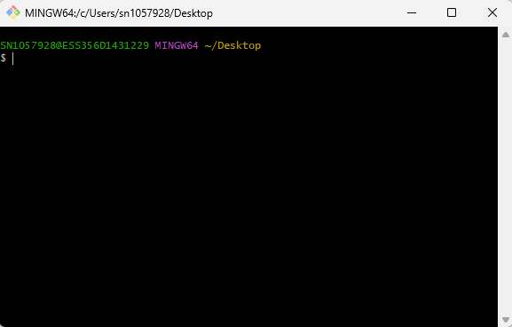

# Aula08 - Versionamento no Github
- Colaboração
- Projetos de código aberto
- Controle de versão

## Atividades realizadas:
- 1 Criação de conta no Github;
- 2 Criação de repositório no Github;

## Prática:

- Após criar uma conta no Github, utilizando um e-mail pessoal, pois após o término do curso a conta será sua e o histórico pode ser importante para futuros processos seletivos.

- Enquanto aguarda seus colegas criar suas contas no github, treine seu raciocínio lógico resolvendo o problema a seguir:

---

## Situação Desafiadora: Conjectura de Collatz
Recebeu este nome em referência ao matemático alemão Lothar Collatz.
### Contetualização:
A Conjectura de Collatz, ou problema, é um enigma matemático simples: para qualquer inteiro positivo, se par, divida por 2; se ímpar, multiplique por 3 e some 1. A conjectura afirma que, repetindo o processo, todos os números chegam ao ciclo que é 1.
- Apesar de testada até números altíssimos, nunca foi provada.

### Desafio:
- Crie um programa que teste esta conjectura e informe quantos passos são necessários para chegar a 1, a partir de um número inteiro positivo informado pelo usuário.
- O programa deve retornar o número de passos e a sequência de números gerada.
- Pode escoher a linguagem de programação que desejar, não se preocupe com a beleza da UI (User Interface) neste momento.
- Salve o programa em uma pasta em sua áre det trabalho, pois ele será versionado no git e enviado para o github.
- Claro que pode contar com a ajuda de uma IA, como o ChatGPT, para ajudá-lo a desenvolver o programa.

### Entrega:
- O programa deve ser enviado para o github, e deixado como público, para que o instrutor e outros colegas possam acessar e aprender com o seu código.

---

## Git e Github
### Baixe o git bash (Git for Windows) em seu computador

- Este é o shell do git, que permite executar os comandos do git em seu computador.
### Cadastre-se no Github e crie um repositório para enviar seu programa
- Acesse o Github e clique em "Sign up" para criar uma conta, utilizando um e-mail pessoal, pois após o término do curso a conta será sua e o histórico pode ser importante para futuros processos seletivos.
- Após criar a conta, clique em "New repository" para criar um repositório,informe o nome do repositório e clique em "Create repository".

### Principais comandos git

| Comando | Descrição |
|-|-|
|git config --global user.name "seu_user_name"|Configura sua conta do github no git|
|git config --global user.email "seu_email@dogithub"|Configura sua conta do github no git|
|git init|Inicia um repositório git|
|git add .|Adiciona os arquivos para o stage|
|git commit -m "mensagem"|Realiza o commit dos arquivos|
|git log|Exibe o histórico de commits|
|git checkout <código do commit>|Permite voltar para um commit específico|
|git remote add origin <url>|Adiciona o repositório remoto|
|git push -u origin master|Envia os arquivos para o repositório remoto|

## [Exemplo prático de versionamento de um programa no git](./versionamento.md)
## Passos para enviar um projeto para o github
- Para enviar os arquivos para o repositório remoto, após iniciar um repositório local `git init`, execute os comandos abaixo para adicionar o repositório remoto e enviar os arquivos para o github:
```bash
git remote add origin <url do repositório remoto>
git push -u origin master
```
- Porém antes de enviar, é necessário criar um repositório no **Github**, para isso, acesse o Github e clique em "New repository", informe o nome do repositório e clique em "Create repository".
- Após criar o repositório, copie a url do repositório e execute os comandos acima para enviar os arquivos para o repositório remoto.
- Pronto, agora os arquivos estão no github e você pode acessar o repositório para visualizar os arquivos e o histórico de commits.

## Conhecimentos:
- 2 Inteligência artificial generativa:
    - 2.1 Definição;
    - 2.2 Aplicações;
    - 2.3 Características:
        - 2.3.1 Treinamento;
        - 2.3.2 Métricas de avaliação;
    - 2.4 ChatGPT;
        - 2.4.1 Interface;
        - 2.4.2 Utilização;
        - 2.4.3 Comandos;
        
### Definição:
- A inteligência artificial generativa é um tipo de inteligência artificial que tem a capacidade de criar conteúdo original, como texto, imagens, música, entre outros. Ela é treinada em grandes conjuntos de dados e utiliza técnicas de aprendizado profundo para gerar conteúdo que pode ser indistinguível do criado por humanos.
### Características:
- Soma de técnicas de aprendizado de máquina, redes neurais e processamento de linguagem natural para criar conteúdo original.
- Pode ser treinada em grandes conjuntos de dados para aprender padrões e gerar conteúdo semelhante.
- Conjunto de treinamento e métricas de avaliação são essenciais para garantir a qualidade do conteúdo gerado.
### ChatGPT:
- O ChatGPT é um modelo de linguagem generativa desenvolvido pela OpenAI, baseado na arquitetura GPT (Generative Pre-trained Transformer). Ele é capaz de gerar texto coerente e relevante em resposta a uma ampla variedade de prompts, tornando-se uma ferramenta poderosa para tarefas como redação, tradução, resumo e muito mais. O ChatGPT é amplamente utilizado em aplicações de processamento de linguagem natural e tem sido uma das principais inovações na área de inteligência artificial generativa.
