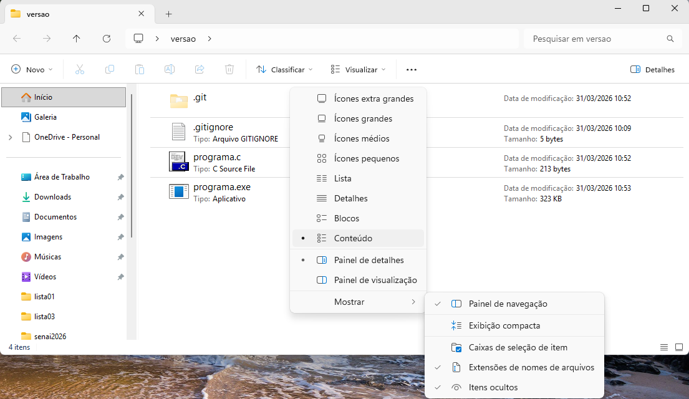

# Passo a passo para versionar o programa no git
- Crie uma pasta em seu computador com o nome "versoes" e dentro dela crie um arquivo programa.c com o seguinte programa:
```c
#include <stdio.h>
void main(){
	int x, y;
	printf("Digite um número inteiro\n");
	scanf("%d", &x);
	y = x * x;
	printf("%d ao quadrado é %d", x, y);
}
```
- Execute o programa e teste com diferentes números.
    - Para isso use um compilador online, como o https://www.onlinegdb.com/online_c_compiler, ou baixe um compilador para seu computador, como o Code::Blocks ou o Dev-C++.
- Crie um outro arquivo chamado .gitignore e adicione a extensão .exe .env para que os arquivos executáveis ou de configuração não sejam enviados para o repositório remoto.
```
*.exe
*.env
```
- Inicie um repositório git na pasta "versoes", adicione os arquivos para o stage, realize o commit e envie para o repositório remoto.
- Clique com o botão direito do mouse na pasta versoes aberta e selecione "Git Bash Here" para abrir o terminal do git bash.
- No terminal, digite os seguintes comandos:
```bash
git init
git add .
git commit -m "Primeira versão do programa"
```
- Pronto, o programa já está versionado.
- 
- Perceba que apenas dois arquivos foram adicionados para o stage, o programa.c e o .gitignore, o arquivo programa.exe não foi adicionado, pois está no .gitignore.
- Vamos alterar o programa para calcular o cubo do número, ou seja, y = x * x * x; e realizar um novo commit.
```c
#include <stdio.h>
void main(){
    int x, y;
    printf("Digite um número inteiro\n");
    scanf("%d", &x);
    y = x * x * x;
    printf("%d ao cubo é %d", x, y);
}
```
- Após alterar o programa, execute os seguintes comandos no terminal do git bash:
```bash
git add .
git commit -m "Segunda versão do programa"
```
- Agora temos duas versões do programa, a primeira versão calcula o quadrado do número e a segunda versão calcula o cubo do número.
- Para visualizar o histórico de commits, execute o comando:
```bash
git log
```
- Para voltar para a primeira versão do programa, execute o comando:
```bash
git checkout <código do commit da primeira versão>
```
- Para voltar para a segunda versão do programa, execute o comando:
```bash
git checkout <código do commit da segunda versão>
```
