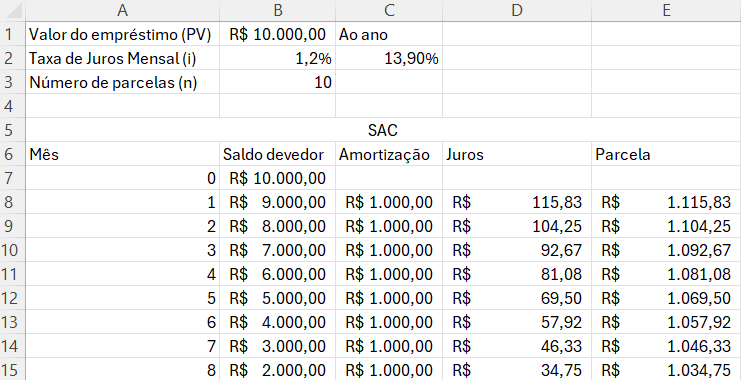
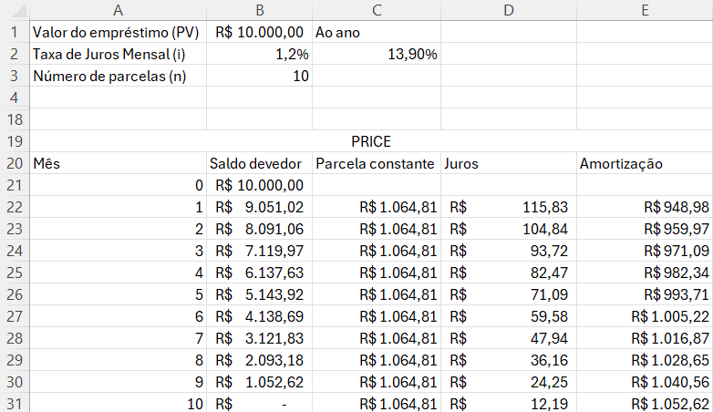

# Empréstimos SAC e PRICE
Para criar uma planilha no Excel comparando os sistemas SAC (Sistema de Amortização Constante) e Price (Sistema Francês com parcelas fixas), use as colunas básicas de período, saldo devedor, prestação, juros e amortização.

## Estrutura Inicial no Excel
Defina células para os dados principais do empréstimo ou financiamento:
- Valor do Empréstimo (PV): R$ 10.000,00 (na célula B1, por exemplo)
- Taxa de Juros Mensal (i): 1% (na célula B2)
- Número de Parcelas (n): 10 meses (na célula B3)

### Como Montar a Tabela SAC
No sistema SAC, a amortização é sempre a mesma (o valor total dividido pelo número de meses) e as parcelas diminuem com o tempo.
- Mês 0: Apenas preencha o Saldo Devedor com o valor total do empréstimo (=B1).
- Mês 1 (Amortização): = $B$1 / $B$3 (fixando as células do valor e prazo).
- Mês 1 (Juros): Multiplique o saldo devedor do mês anterior pela taxa de juros (= Saldo_Anterior * $B$2).
- Mês 1 (Prestação / Parcela): Some a amortização com os juros (= Amortização + Juros).
- Mês 1 (Novo Saldo Devedor): Subtraia a amortização do saldo anterior (= Saldo_Anterior - Amortização).
- Arraste as fórmulas para baixo até o mês 10.

### Como Montar a Tabela Price
No sistema Price, as parcelas (prestações) são constantes.
- Mês 0: Defina o Saldo Devedor igual ao valor total do empréstimo (=B1).
- Prestação Fixa: Utilize a função =PGTO($B$2; $B$3; -$B$1) para encontrar o valor da parcela mensal constante.
- Mês 1 (Juros): Calcule sobre o saldo anterior (= Saldo_Anterior * $B$2).
- Mês 1 (Amortização): Subtraia os juros da prestação fixa (= Prestação_Fixa - Juros).
 -Mês 1 (Novo Saldo Devedor): Subtraia a amortização calculada do saldo anterior (= Saldo_Anterior - Amortização).
- Arraste as fórmulas para baixo até o último período.
