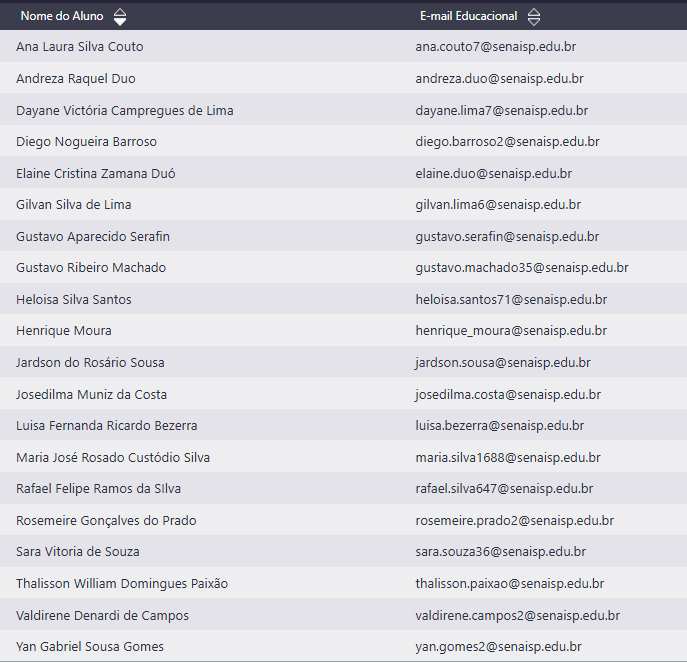

# Aula01

## E-mails educacionais
### Passo a passo para o primeiro acesso:
- Acesse o *[Portal Educacional](https://pess.sesisenaispedu.org.br/)* SESI SENAI ou a página de login da sua unidade.
- Clique na opção de Primeiro acesso, **O que fazer**? ou Registrar senha.
- Digite o seu CPF e a sua data de nascimento.
- Leia e aceite o termo de compromisso ou contrato com as regras de uso.
- Confirme o seu e-mail pessoal cadastrado na matrícula, para onde as instruções e o link de confirmação serão enviados.
- Abra o seu e-mail pessoal, clique no link recebido e cadastre uma senha nova (seguindo os critérios de segurança, como letras maiúsculas, minúsculas e números).
- Aguarde cerca de 30 minutos para a atualização dos dados no sistema e faça o login usando seu CPF/e-mail institucional e a nova senha criada
### [Portal educacional](https://pess.sesisenaispedu.org.br/)
### Lista de e-mails

## Aula
- Acessar o [Outlook.com](https://outlook.live.com/mail/)
- Entrar
- Email e senha
- Pontinhos - Excel