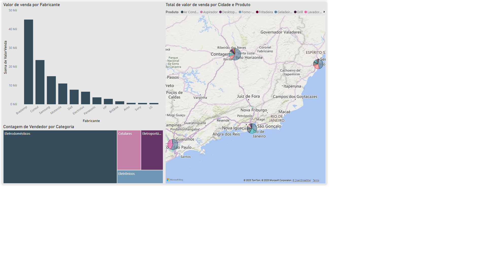
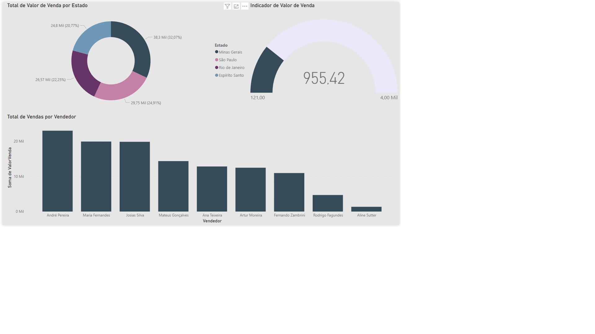
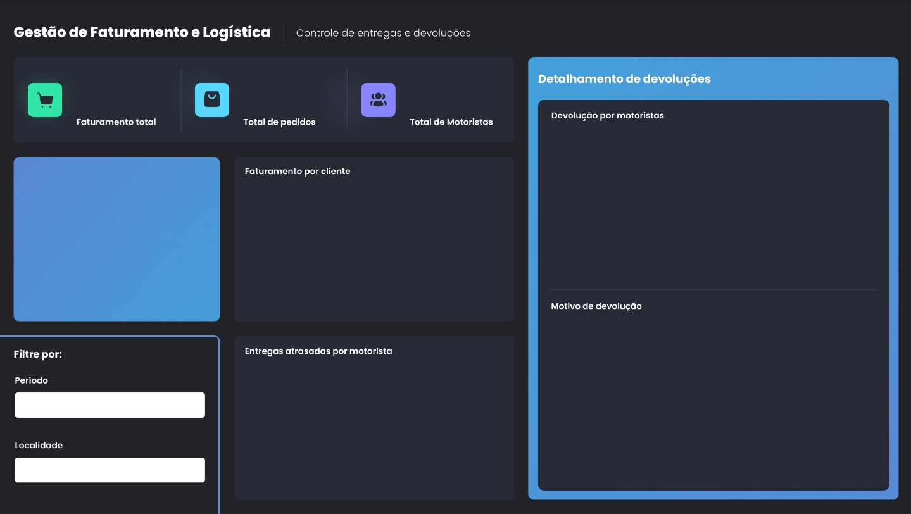
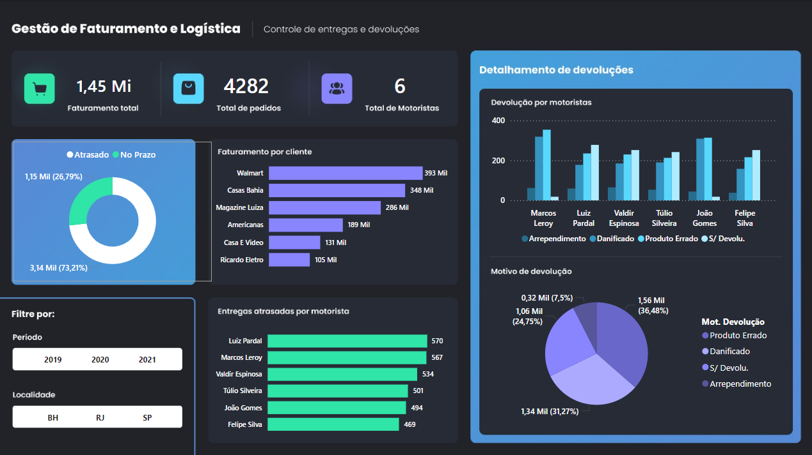

# Aula04
## Fontes de dados variadas e API
### Temas
- Varegistas do Sudeste (Combinar dados csv)
- Endereços a partir da API Via CEP: JSON https://viacep.com.br/ws/SP/Jaguari%C3%BAna/Bueno/json

# Atividade 01
Em seu computador crie uma pasta chamada **"sudeste"** e baixe para dentro dela os arquivos **.csv** contidos neste repositório, na subpasta **/varegistasudeste**.
- 1 Abra o **Power BI** e crie um novo projeto, importe os arquivos **csv** e **combine** os dados.
- 2 Crie dois relatórios com os dados dos arquivos conforme imagens a seguir:
  -  2.1 Uma análise gráfica do valor de venda por categoria
  -  2.2 Outra de vendedor por categoria em um gráfico de mapa de árvore
  -  2.3 E um com uma análise com mapa.

- 3 Crie outra página de dashboard analisando:
  - 3.1 Faça um gráfico de valor de venda por estado.
  - 3.2 Uma de valor de venda do primeiro segmento.
  - 3.3 Um gráfico de valor de venda por vendedor

# Atividade 02
Vamos treinar o ajuste fino de um visual.
 Baixe em seu computador a planilha **/logistica/dados.xlsx** com informações de pedidos e entregas.
- 1 Abra o **Power BI** e crie um novo projeto, importe a planilha.
- 2 Transforme os dados, alterando os tipos se necessário.
- 3 Coloque o layout a seguir como plano de fundo.
 
- 4 Crie um dashboard semelhante ao da imagem a seguir:
 