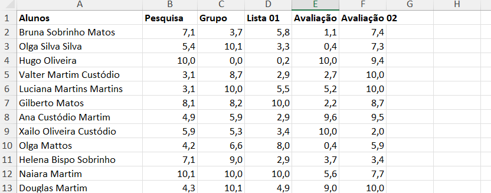
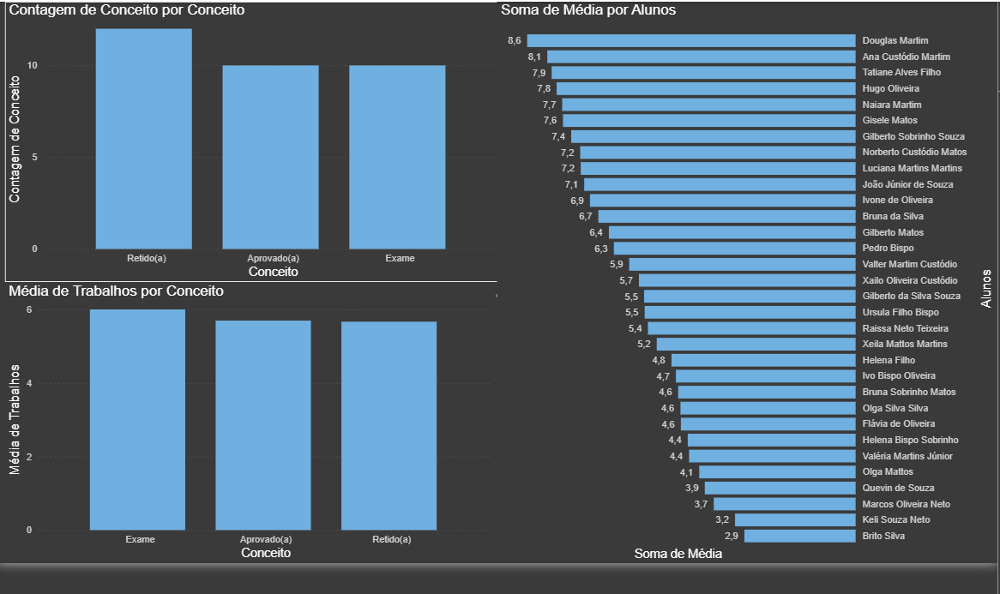

# Aula05 - DAX - Tema Notas

## Analisando notas de uma turma
A partir dos dados da planilha *[resultados.xlsx](./resultados.xlsx)* nesta pasta.
- Baixe a planilha em seu computador
- Abra o PowerBI Desktop e obtenha os dados
- Se necessário transforme com o Power Query

## Vamos estabelecer os critérios de avaliação
- 1 Os três primeiros meios (Pesquisa, Grupo e Lista 01) valem 30% da média final (trabalhos)
- 2 Cada Avaliação vale 35% da média
## Avaliando
- Crie uma coluna calculando a média das três primeiras notas, chame esta coluna de **Trabalhos**
- Agora crie outra coluna calculando a média ponderada de cada aluno, chame esta coluna de **Média**
- Para aprovação o aluno deve obter média 7 então crie uma coluna chamado **Conceito** classificando as médias como: maior ou igual a 7 "Aprovado(a)", maior ou igual a 5 "Exame" e menor do que 5 "Retido".

## Visual exemplo

